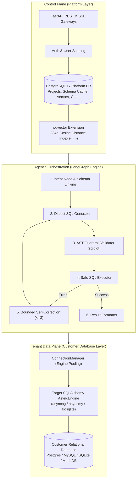
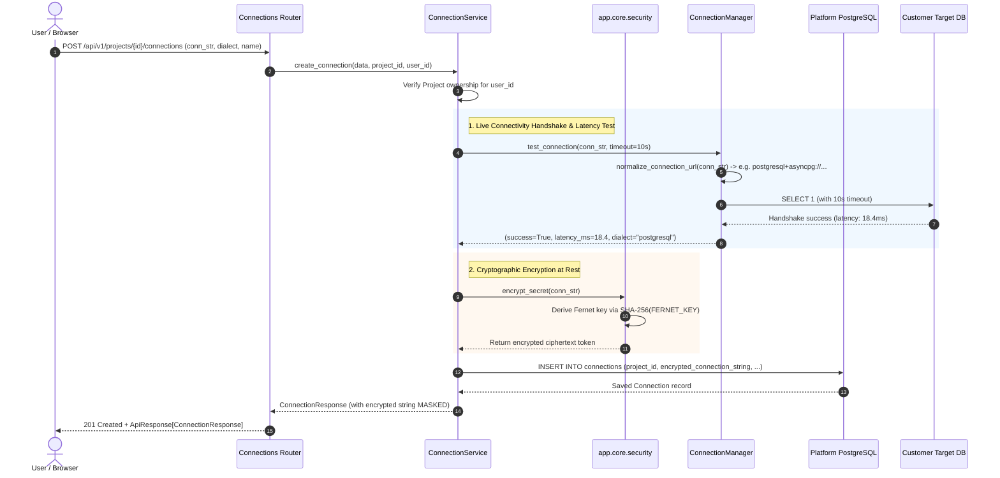
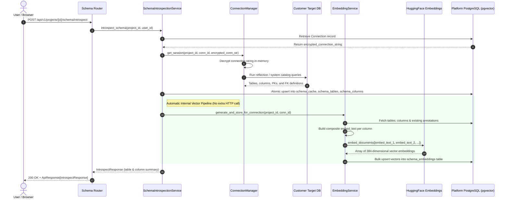
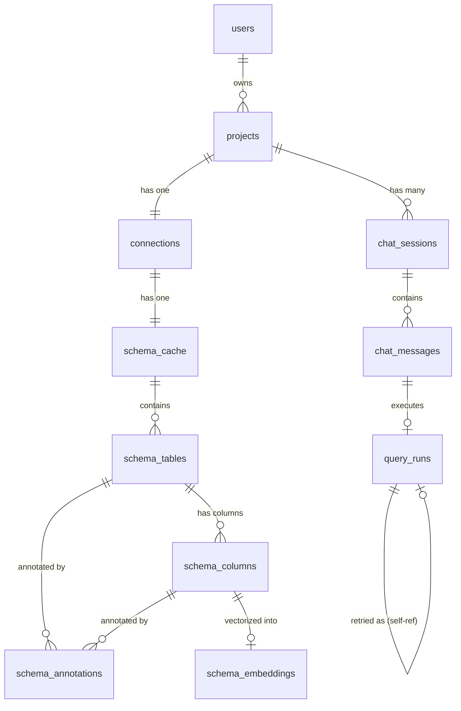

# 📚 Technical Documentation & System Flow Specification

> **Natural Language Database Querying Platform**  
> Complete Architectural Blueprint, Component Deep Dive, and End-to-End Execution Flows.

---

## 1. Architectural Foundations & Design Principles

The platform is designed around strict separation of concerns, enterprise-grade multi-tenancy, and deterministic agentic execution. It operates on two distinct conceptual planes:



### 1.1 Control Plane vs. Tenant Data Plane Separation
- **Platform Control Plane**: Manages tenant metadata, user identities, encrypted credentials, cached schema representations, semantic annotations, vector embeddings, and conversation histories. It runs on a dedicated PostgreSQL 17 database equipped with the `pgvector` extension.
- **Tenant Data Plane**: The customer's actual relational database (PostgreSQL, MySQL, SQLite, MariaDB, etc.). The platform **never** replicates or stores customer table records. It only connects to the customer database on-demand to execute strictly validated, read-only `SELECT` statements with row limits and timeouts.

### 1.2 Domain-Driven Modular 5-Tier Architecture
All backend functionality under `backend/app/domain/<module>/` adheres to a strict 5-tier layer separation (see [AGENTS.md](file:///c:/Users/Lenovo/OneDrive/Desktop/Db-chatbot/AGENTS.md)):

```text
┌────────────────────────────────────────────────────────┐
│ 1. Router (router.py)                                 │  <- Thin HTTP controllers, dependency injection,
│                                                        │     status codes, ApiResponse wrapping
├────────────────────────────────────────────────────────┤
│ 2. Service (services.py)                              │  <- Business logic, transaction boundaries,
│                                                        │     orchestration, cross-domain coordination
├────────────────────────────────────────────────────────┤
│ 3. Repository (repository.py)                         │  <- Data access layer, CRUDBase inheritance,
│                                                        │     SQLAlchemy 2.0 select() queries
├────────────────────────────────────────────────────────┤
│ 4. Schemas (schemas.py)                               │  <- Pydantic v2 validation, DTOs,
│                                                        │     serialization, from_attributes=True
├────────────────────────────────────────────────────────┤
│ 5. Models (models.py)                                 │  <- Declarative SQLAlchemy ORM entities,
│                                                        │     mixins (UUIDPrimaryKeyMixin, TimestampMixin)
└────────────────────────────────────────────────────────┘
```

### 1.3 Strict Multi-Tenant Isolation Rule
Every platform resource (`Connection`, `SchemaCache`, `SchemaTable`, `SchemaColumn`, `SchemaAnnotation`, `SchemaEmbedding`, `ChatSession`, `ChatMessage`, `QueryRun`) has a non-nullable foreign key to `project_id`. All database queries, vector similarity searches, and chat executions are explicitly scoped with:
$$\text{WHERE } \text{project\_id} = \text{current\_project\_id}$$
Cross-tenant data access is blocked at the ORM layer, the vector search layer, and the connection pooling layer.

---

## 2. End-to-End System Execution Flows

### Flow 1: Database Connection & Fernet Encryption Lifecycle

This flow handles target database onboarding, connection string encryption, connectivity verification, and engine pool initialization.



#### Key Mechanics:
1. **URL Normalization**: User URIs (`postgres://`, `postgresql://`, `mysql://`, `sqlite://`) are normalized to their async SQLAlchemy counterparts (`postgresql+asyncpg://`, `mysql+asyncmy://`, `sqlite+aiosqlite://`).
2. **Secret Encryption**: Connection strings are encrypted via Fernet symmetric encryption. Decrypted credentials **never** leave the `ConnectionManager`.
3. **Password Masking in Errors**: If testing fails, the error message passes through regex credential sanitization:
   ```python
   re.sub(r"://([^:]+):([^@]+)@", r"://\1:***@", err_msg)
   ```

---

### Flow 2: Schema Introspection & Automated Vector Linking

This flow inspects the target database schema, builds a cached relational representation in the platform DB, and automatically generates 384-dimensional vector embeddings for schema linking.



#### Composite Embedding Text Structure:
To maximize semantic search accuracy, each column embedding encapsulates both its parent table context and relational constraints:
```text
Table: public.orders
Columns: id, customer_id, total_amount, status, created_at
Primary Keys: id
Foreign Keys: customer_id -> customers.id
---
Column: total_amount
Type: NUMERIC(10,2)
Nullable: no
Primary Key: no
Foreign Key: no
---
Table Description: Customer sales orders and checkout transactions
Column Description: Total final monetary amount billed to the customer
```

---

### Flow 3: The Core NL-to-SQL Agent Pipeline (LangGraph State Machine)

This is the central reasoning engine of the platform. It executes whenever a user sends a natural language question via the Server-Sent Events (SSE) streaming endpoint.

```mermaid
flowchart TD
    Start([User NL Message via SSE]) --> InitState[Initialize AgentState in ChatService]
    InitState --> StartNode((START))
    
    StartNode --> IntentNode[Node: intent]
    
    subgraph IntentSubGraph ["Intent Node Internal Logic"]
        RegexCheck{Regex Match\nUnsafe Intent?}
        RegexCheck -->|Yes: DROP, DELETE, etc.| MarkUnsafe[Set intent_type = 'unsafe']
        RegexCheck -->|No| LLMIntent[LLM Intent Classifier\nlookup | aggregation | comparison | trend | general]
        LLMIntent --> CheckGeneral{intent == 'general'?}
        CheckGeneral -->|Yes| SkipSchema[Skip Vector Search]
        CheckGeneral -->|No| VectorSearch[pgvector Cosine Search <=> (Top-K Columns)]
        VectorSearch --> FKExpansion[Outward FK & Junction Table Expansion]
        FKExpansion --> SchemaFormat[Format Structured Schema Context + Join Hints]
    end

    IntentNode --> IntentRouter{route_after_intent}
    
    IntentRouter -->|intent == 'unsafe'| UnsafeNode[Node: unsafe_handler]
    IntentRouter -->|intent == 'general'| GeneralNode[Node: general_chat]
    IntentRouter -->|SQL Query Needed| SQLGenNode[Node: sql_generator]
    
    subgraph SQLGenSubGraph ["SQL Generator Internal Logic"]
        CheckRetry{Is Retry?\nretry_count > 0}
        CheckRetry -->|No| StandardPrompt[Format SQL_GENERATION_PROMPT with Schema & History]
        CheckRetry -->|Yes| CorrectionPrompt[Format SQL_CORRECTION_PROMPT with Failed SQL & DB Error]
        StandardPrompt --> InvokeLLM[Invoke LLM Client]
        CorrectionPrompt --> InvokeLLM
        InvokeLLM --> CleanSQL[extract_clean_sql: Strip Markdown & Explanations]
    end

    SQLGenNode --> SQLExecNode[Node: sql_executor]
    
    subgraph SQLExecSubGraph ["SQL Executor Internal Logic"]
        ASTValidate{sqlglot AST Parse:\nOnly SELECT/CTE?\nNo Semicolons?}
        ASTValidate -->|Invalid AST| SetASTError[Set execution_error & increment retry_count]
        ASTValidate -->|Valid AST| RunQuery[ConnectionManager.execute_safe\nTimeout 10s | Limit 1000 Rows]
        RunQuery -->|DB Exception| SetDBError[Set execution_error & increment retry_count]
        RunQuery -->|Success| SaveResults[Store execution_result rows & clear error]
    end

    SQLExecNode --> ExecRouter{route_after_execution}
    
    ExecRouter -->|Success| ResultFormatNode[Node: result_formatter]
    ExecRouter -->|Error & retries < 3| SQLGenNode
    ExecRouter -->|Error & retries >= 3| ErrorTerminalNode[Node: error_terminal]
    
    ResultFormatNode --> FormatSummary[LLM summarizes results in English]
    FormatSummary --> EndNode((END))
    
    ErrorTerminalNode --> UserFriendlyErr[Output actionable failure explanation]
    UserFriendlyErr --> EndNode
    
    UnsafeNode --> BlockedMsg[Output Read-Only Refusal Notice]
    BlockedMsg --> EndNode
    
    GeneralNode --> ConversationalMsg[Output Chat Response without SQL]
    ConversationalMsg --> EndNode
    
    EndNode --> CheckpointPersist[Persist State to ChatMessage & QueryRun in Platform DB]
    CheckpointPersist --> StreamComplete([Emit 'done' SSE Event])
```

---

## 3. Deep Dive into LangGraph Nodes & Components

### 3.1 Node 1: `intent` (`app.domain.agent.nodes.intent`)
- **Deterministic Pre-Classification Guardrail**:
  Runs `detect_unsafe_intent(user_query)` against a precompiled regex pattern.
  Matches queries such as `drop table`, `delete from`, `truncate`, `alter table`, `insert into`, `grant`, `revoke`.
  If matched, immediately sets `intent_type = "unsafe"` without invoking the LLM, preventing adversarial prompt injections from bypassing classification.
- **LLM Intent Classification**:
  Prompts the LLM with `INTENT_CLASSIFICATION_PROMPT` to classify the query into:
  - `lookup`: Point lookups (e.g., *"Find user by email"*).
  - `aggregation`: Sums, counts, averages, group-bys.
  - `comparison`: Benchmarking entities against each other.
  - `trend`: Time-series, growth over time.
  - `general`: Chit-chat or greetings (*"Hello"*, *"Who are you?"*).
- **Vector Schema Linking (`pgvector`)**:
  Invokes `EmbeddingService.search_schema()` using cosine distance `<=>`. Retrieves top matching columns based on the semantic query.
- **Schema Graph Traversal (`expand_schema_tables`)**:
  A pure vector match may miss junction or parent tables required for valid `JOIN`s. The expansion algorithm:
  1. Identifies directly matched tables.
  2. Identifies entity names mentioned in the prompt.
  3. Traverses foreign keys outwards (`_expand_outward_fks`) to include parent tables (e.g., `order_items` references `orders` and `products`).
  4. Detects junction tables (`_find_junction_tables`) connecting any pair of matched tables.
- **Join Hint Assembly**:
  Generates explicit join syntax hints in the prompt (e.g., `orders.customer_id -> customers.id (JOIN customers ON orders.customer_id = customers.id)`), eliminating hallucinated joins.

---

### 3.2 Node 2: `sql_generator` (`app.domain.agent.nodes.sql_generator`)
- **Dual-Mode Prompting**:
  - **Fresh Query**: Injects dialect instructions, conversational history, and structured schema context into `SQL_GENERATION_PROMPT`.
  - **Self-Correction Retry**: If `retry_count > 0` and `execution_error` is populated, the node automatically switches to `SQL_CORRECTION_PROMPT`. It presents the LLM with:
    - The original user question.
    - The failed SQL query.
    - The exact database error traceback.
    - Historical error attempts.
- **Dialect Awareness**:
  Ensures dialect-specific syntax (PostgreSQL `ILIKE`, `DATE_TRUNC`; MySQL `DATE_FORMAT`, backticks; SQLite string functions).
- **Clean SQL Extraction**:
  Runs `extract_clean_sql()` to strip markdown code blocks (` ```sql ... ``` `), comments, and conversational filler.

---

### 3.3 Node 3: `sql_executor` (`app.domain.agent.nodes.sql_executor`)
- **AST-Level Read-Only Validation (`validate_read_only`)**:
  Before any statement touches the database connection, it is parsed by `sqlglot`:
  1. Strips all comments (`--`, `/* */`).
  2. Ensures the statement is single (no semicolon-chained execution).
  3. Verifies the root statement type is `exp.Select`, `exp.Union`, `exp.Intersect`, or `exp.Except`.
  4. Recursively walks every node in the AST expression tree to ensure zero occurrences of `_FORBIDDEN_EXPRESSIONS` (`exp.Insert`, `exp.Update`, `exp.Delete`, `exp.Drop`, `exp.Alter`, `exp.Grant`, etc.).
- **Safe Execution via `ConnectionManager.execute_safe()`**:
  - Executes query in an isolated tenant session.
  - Enforces `asyncio.wait_for(timeout=10.0)`.
  - Enforces row limit cap (`fetchmany(1000)`).
  - Serializes database types (`Decimal` $\to$ float/str, `datetime` $\to$ ISO 8601, `UUID` $\to$ str).

---

### 3.4 Bounded Self-Correction Routing (`route_after_execution`)
- If execution completes without error: routes to `result_formatter`.
- If an execution or validation error occurs:
  - If `retry_count < 3`: increments `retry_count`, logs the error in `error_history`, and routes back to `sql_generator`.
  - If `retry_count >= 3`: aborts retry loop and routes to `error_terminal`.

---

### 3.5 Node 4: `result_formatter` (`app.domain.agent.nodes.result_formatter`)
- Formats the top 15 rows of data into a compact JSON string.
- Prompts the LLM via `RESULT_SUMMARY_PROMPT` to draft a concise, conversational executive summary answering the user's specific natural language prompt.
- Handles empty result sets gracefully (*"The query completed successfully, but no matching records were found."*).

---

### 3.6 Node 5: `error_terminal` (`app.domain.agent.nodes.error_terminal`)
- Invoked when the 3-attempt self-correction budget is exhausted.
- Formulates a helpful explanation of the failure, explaining the database error in non-technical terms and advising the user on how to rephrase or verify schema permissions.

---

### 3.7 Node 6: `unsafe_handler` (`app.domain.agent.nodes.unsafe_handler`)
- Invoked when destructive DDL/DML intent is caught.
- Returns a standardized security notification explaining the platform's read-only mission and offering valid query examples.

---

## 4. Platform Database Schema & Entity Relationships

The platform control plane is normalized into 10 core tables with strict foreign key constraints and multi-tenant indexes:



### Table Specifications:

| Table Name | Primary Key | Key Foreign Keys | Purpose |
| :--- | :--- | :--- | :--- |
| `users` | `id` (UUID) | None | Authenticated user accounts (`email`, `hashed_password`, `is_active`) |
| `projects` | `id` (UUID) | `owner_id -> users.id` | Multi-tenant boundary grouping connections, schemas, and chats |
| `connections` | `id` (UUID) | `project_id -> projects.id` | Target database connection metadata & Fernet-encrypted URI |
| `schema_cache` | `id` (UUID) | `project_id`, `connection_id` | Timestamped raw JSON snapshot of the introspected database catalog |
| `schema_tables` | `id` (UUID) | `project_id`, `connection_id`, `cache_id` | Normalized table metadata (`schema_name`, `table_name`) |
| `schema_columns`| `id` (UUID) | `project_id`, `connection_id`, `table_id` | Normalized column definitions (`data_type`, PK/FK flags, ordinal position) |
| `schema_annotations` | `id` (UUID) | `project_id`, `connection_id`, `schema_table_id`, `schema_column_id` | User & AI-generated business context, descriptions, and glossaries |
| `schema_embeddings` | `id` (UUID) | `project_id`, `connection_id`, `schema_column_id` | 384-dimensional vector embeddings stored with `vector(384)` for cosine search |
| `chat_sessions` | `id` (UUID) | `project_id`, `connection_id` | Conversational threads maintaining multi-turn context |
| `chat_messages` | `id` (UUID) | `session_id`, `project_id`, `query_run_id` | Message history (`role`, `content`, `token_count`, `metadata`) |
| `query_runs` | `id` (UUID) | `chat_message_id`, `parent_run_id` | Audit trail of every SQL execution attempt, latency, row count, status, and error |

---

## 5. Server-Sent Events (SSE) Streaming Protocol

The platform communicates intermediate reasoning steps to the frontend via Server-Sent Events over HTTP (`GET /api/v1/projects/{project_id}/chat/sessions/{session_id}/stream?message=...`).

### SSE Event Lifecycle:

```text
Client Connection Established
   │
   ├─► event: intent_classified
   │   data: {"intent_type": "aggregation", "extracted_entities": ["orders", "revenue"]}
   │
   ├─► event: sql_generated
   │   data: {"generated_sql": "SELECT SUM(total) FROM orders...", "sql_dialect": "postgresql"}
   │
   ├─► [Optional if execution fails] event: sql_error
   │   data: {"error": "column orders.total does not exist", "retry_count": 1}
   │
   ├─► event: sql_executed
   │   data: {"row_count": 1, "sample_rows": [{"sum": 128450.50}]}
   │
   ├─► event: summary_ready
   │   data: {"nl_summary": "The total revenue across all completed orders is $128,450.50."}
   │
   ├─► event: done
   │   data: {"session_id": "...", "message_id": "...", "query_run_id": "..."}
   │
   └─► Connection Closed
```

---

## 6. Unified API Response Envelope Specification

All non-streaming REST endpoints return responses wrapped in the canonical envelope defined in `app.core.responses`:

### Success Single Resource Envelope:
```json
{
  "success": true,
  "message": "Connection established successfully",
  "data": {
    "id": "e6a4b2c1-9f8d-4e2b-b1a0-7c3d5e8f9a0b",
    "name": "Production Analytics Replica",
    "dialect": "postgresql",
    "created_at": "2026-09-23T15:30:00Z"
  },
  "error": null
}
```

### Success Paginated Collection Envelope:
```json
{
  "success": true,
  "message": "Chat sessions retrieved successfully",
  "data": {
    "items": [
      {
        "id": "1a2b3c4d-...",
        "title": "Quarterly Revenue Analysis",
        "created_at": "2026-09-23T16:00:00Z"
      }
    ],
    "total": 1,
    "skip": 0,
    "limit": 20
  },
  "error": null
}
```

### Error Envelope:
```json
{
  "success": false,
  "message": "Only read-only SELECT statements are permitted.",
  "data": null,
  "error": {
    "code": "BAD_REQUEST",
    "message": "Only read-only SELECT statements are permitted.",
    "details": {
      "statement_type": "Insert",
      "reason": "Forbidden operation 'Insert' detected within SQL AST."
    }
  }
}
```

---

## 7. Frontend Integration & Client Architecture

The frontend is built with **Next.js 15 (App Router)** and **React 19**:

- **Authentication Interceptor**: All client-side API requests pass through `frontend/src/lib/api.ts`, automatically attaching the Bearer JWT token from `localStorage`.
- **SSE Stream Hook (`useSSEChat`)**: Connects to the SSE endpoint using `fetch()` and an `EventSource` reader, progressively updating the chat UI state machine as each event (`intent_classified`, `sql_generated`, `sql_executed`, `summary_ready`) arrives.
- **SQL Preview & Data Table**:
  - Renders generated SQL with syntax highlighting.
  - Interactive table component renders query result rows with column sorting and pagination.
  - Toggles between the conversational executive summary, execution metrics (latency, row count), and raw data.

---

## 8. Verification & Operational Runbook

### 8.1 Automated Test Execution
Run the complete test suite across unit and integration boundaries:
```bash
cd backend
pytest -v
```

### 8.2 Linting & Static Type Verification
```bash
# Code formatting and rule compliance
ruff check .
ruff format --check .

# Strict static type checking
pyright
```

### 8.3 Database Migration Operations
When modifying platform models:
```bash
# Create a new migration revision
alembic revision --autogenerate -m "add_new_audit_field"

# Apply pending migrations
alembic upgrade head

# Rollback one migration step
alembic downgrade -1
```

---

## 9. Summary & Architectural Invariants

To maintain system integrity, all developers and AI agents must uphold these core rules:
1. **Never bypass `ConnectionManager`**: Connection strings must never be decrypted anywhere else in the application.
2. **Never execute SQL without AST validation**: All target queries must pass through `validate_read_only()` before execution.
3. **Always filter by `project_id`**: No cross-tenant database or vector operations are permitted.
4. **Never log decrypted secrets**: Raw passwords or authorization tokens must never be written to logs.
