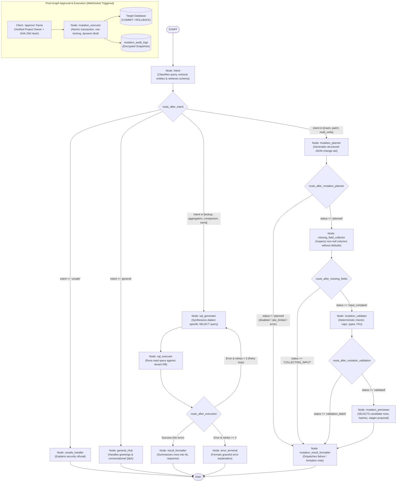

# LangGraph Agent Workflow Architecture & Node Reference

This document provides a comprehensive technical reference for the **LangGraph Agent Workflow** in the Database Chatbot platform. It details the complete dual-path execution model (Read vs. Write / HITL), complete state schemas, routing logic, and in-depth notes on each node.

---

## 1. High-Level Architecture & Workflow Model

The agent pipeline is orchestrated using **LangGraph** (`CompiledStateGraph`). The graph maintains a unified conversation state (`AgentState`) and branches cleanly based on user intent into two primary execution pathways:

1. **The Read Path (NL-to-SQL with Self-Correction)**: Converts natural language questions into safe `SELECT` queries, executes them against tenant databases, automatically corrects syntax/schema errors through a bounded 3-turn retry loop, and synthesizes tabular results into actionable natural language answers.
2. **The Write Path (Safe HITL Multi-Table Mutations)**: Enforces zero raw DML generation by the LLM. It plans structured JSON change-sets with foreign-key dependency links (`$ref`), prompts for all missing required fields in one turn, validates schema types and quotas deterministically, generates live candidate row previews, and requires explicit Project Owner approval via WebSocket before running atomic transactions.

---

## 2. Complete Workflow Diagram

---

## 3. Detailed Node-by-Node Specification

### 3.1 Node: `intent` (Intent Classification & Semantic Schema Linking)
- **Source File**: `backend/app/domain/agent/nodes/intent.py`
- **Purpose**: First stage of graph execution. Analyzes user queries to classify operational intent, extracts mentioned domain entities, searches the vector database for relevant database tables and columns, and retrieves relationship JOIN paths.
- **Input State**:
  - `user_query`: Raw natural language prompt from user.
  - `project_id`: Tenant project identifier.
- **Internal Logic**:
  1. Screens query through pre-LLM regex guardrails (`detect_unsafe_intent`).
  2. Submits query to LLM using `INTENT_CLASSIFICATION_PROMPT` to classify into: `lookup`, `aggregation`, `comparison`, `trend`, `general`, `unsafe`, `insert`, `patch`, `multi_write`.
  3. If intent is `unsafe`, immediately halts further schema lookups.
  4. Queries `EmbeddingService.search_schema()` using vector similarity against pre-computed schema embeddings.
  5. Expands schema using outward foreign key relationships and detects junction tables (`expand_schema_tables`).
  6. Formats structured schema definitions and relationship JOIN hints (`format_schema_context_from_table_details`).
- **Output State Delta**:
  - `intent_type`: Categorized intent string.
  - `extracted_entities`: List of identified database entities/concepts.
  - `relevant_schema`: Dictionary mapping table names to column metadata.
  - `schema_context`: String representation injected into downstream LLM prompts.
- **Downstream Router**: `route_after_intent`.

---

### 3.2 Node: `unsafe_handler` (Security Refusal)
- **Source File**: `backend/app/domain/agent/nodes/unsafe_handler.py`
- **Purpose**: Generates polite, structured security refusals when prompt injection, system hacking, or forbidden operations are detected.
- **Input State**:
  - `intent_type`: `"unsafe"`.
  - `user_query`: The blocked query string.
- **Internal Logic**:
  - Bypasses all database and schema access.
  - Constructs a helpful refusal message clarifying that destructive statements (`DROP`, `TRUNCATE`, `ALTER`, privilege escalation) and sensitive system files are inaccessible.
- **Output State Delta**:
  - `nl_summary`: Security explanation message.
  - `execution_error`: Security violation flag.
- **Downstream Router**: Direct edge to `END`.

---

### 3.3 Node: `general_chat` (Conversational Handler)
- **Source File**: `backend/app/domain/agent/nodes/general_chat.py`
- **Purpose**: Handles conversational greetings, platform capability inquiries, or generic domain questions that do not require executing database queries.
- **Input State**:
  - `user_query`: Conversational user message.
  - `messages`: Multi-turn chat message history.
- **Internal Logic**:
  - Prompts LLM with general chatbot system instructions.
  - Explains database querying features, guidance on supported questions, and data structure overview.
- **Output State Delta**:
  - `nl_summary`: Conversational assistant response.
- **Downstream Router**: Direct edge to `END`.

---

### 3.4 Node: `sql_generator` (Dialect-Specific SQL Synthesizer)
- **Source File**: `backend/app/domain/agent/nodes/sql_generator.py`
- **Purpose**: Generates read-only `SELECT` SQL queries tailored to the target database dialect (PostgreSQL, MySQL, SQLite).
- **Input State**:
  - `user_query`: User prompt.
  - `schema_context`: Schema tables, columns, and foreign key relationships.
  - `sql_dialect`: Dialect of the tenant database.
  - `retry_count`: Current attempt count (0 on first run, 1–3 in retry loop).
  - `error_history`: Feedback from prior failed execution attempts.
- **Internal Logic**:
  1. Injects `SQL_GENERATION_PROMPT` containing schema, join hints, few-shot examples, and strict read-only constraints.
  2. If `retry_count > 0`, appends `ERROR_CORRECTION_PROMPT` with the failed SQL and exact database error message.
  3. Extracts generated SQL from markdown code blocks.
  4. Runs deterministic SQL validation (`validate_safe_read_sql`) using AST parser (`sqlglot`) to guarantee statement is strictly `SELECT` with no write/DDL side effects.
- **Output State Delta**:
  - `generated_sql`: Sanitized, executable `SELECT` statement.
  - `error_history`: Appended with generation notes.
- **Downstream Route**: Edge to `sql_executor`.

---

### 3.5 Node: `sql_executor` (Safe Read Query Executor)
- **Source File**: `backend/app/domain/agent/nodes/sql_executor.py`
- **Purpose**: Executes the sanitized SQL query against the tenant database via `ConnectionManager` and returns serialized tabular results.
- **Input State**:
  - `generated_sql`: The query to execute.
  - `project_id`, `connection_id`: Tenant routing keys.
  - `retry_count`: Current retry index.
- **Internal Logic**:
  1. Validates connection health and acquires engine.
  2. Executes query with execution timeout safeguards (15s default).
  3. Enforces row truncation limits (up to 100 rows fetched for prompt context).
  4. Serializes complex Python objects (UUIDs, Decimals, Dates, Bytearrays) into JSON-compatible primitives.
  5. Catches database dialect exceptions (e.g. `UndefinedTable`, `UndefinedColumn`, syntax errors).
- **Output State Delta**:
  - `execution_result`: List of row mapping dicts (on success).
  - `execution_error`: String error message (on failure; triggers retry).
  - `retry_count`: Incremented on failure.
- **Downstream Router**: `route_after_execution` (Self-correction loop).

---

### 3.6 Node: `result_formatter` (Natural Language Data Synthesizer)
- **Source File**: `backend/app/domain/agent/nodes/result_formatter.py`
- **Purpose**: Converts raw tabular database rows into clear, conversational summaries with markdown tables, key metrics, and insights.
- **Input State**:
  - `user_query`: Original natural language question.
  - `generated_sql`: The executed query.
  - `execution_result`: The rows returned by the database.
- **Internal Logic**:
  1. Evaluates result size: if 0 rows returned, crafts friendly "No records found" explanation.
  2. If rows are present, prompts LLM with `RESULT_FORMATTER_PROMPT` to analyze trends, calculate totals/averages, and highlight anomalies.
  3. Formats tabular data in GitHub-flavored markdown tables.
- **Output State Delta**:
  - `nl_summary`: Final formatted markdown text.
- **Downstream Route**: Direct edge to `END`.

---

### 3.7 Node: `error_terminal` (Exhausted Retry Handler)
- **Source File**: `backend/app/domain/agent/nodes/error_terminal.py`
- **Purpose**: Terminal node invoked when the 3-attempt self-correction loop fails to produce valid executable SQL.
- **Input State**:
  - `execution_error`: The last recorded database error.
  - `error_history`: Sequence of all attempted queries and errors.
  - `user_query`: User question.
- **Internal Logic**:
  - Synthesizes user-friendly explanation of why the query could not be executed.
  - Explains the missing columns, ambiguous relations, or syntax limitations without leaking raw connection credentials or internal system traces.
  - Suggests alternative, simpler queries.
- **Output State Delta**:
  - `nl_summary`: Formatted explanation and troubleshooting recommendations.
- **Downstream Route**: Direct edge to `END`.

---

### 3.8 Node: `mutation_planner` (Structured Change-Set Synthesizer)
- **Source File**: `backend/app/domain/agent/nodes/mutation_planner.py`
- **Purpose**: Entry node for write operations. Orchestrates LLM prompt to output typed JSON change-sets. Strictly forbidden from producing raw executable DML SQL.
- **Input State**:
  - `user_query`: Write instruction (e.g. "Create department HR and add Alice as Manager").
  - `intent_type`: `insert`, `patch`, or `multi_write`.
  - `project_id`, `connection_id`: Tenant routing keys.
- **Internal Logic**:
  1. Verifies `connection.writes_enabled == True`. If false, aborts with `"writes_disabled"`.
  2. Runs rate limiting and failure cooldown checks (`MutationRateLimiter.check_all_write_limits`):
     - Session pending cap ($\le 3$).
     - Hourly write cap ($\le 30$).
     - Hourly row cap ($\le 200$).
     - 60s post-failure cooldown.
  3. Injects live schema context into `MUTATION_PLANNING_PROMPT`. Instructs LLM to generate structured JSON conforming to `ChangeSetProposal`.
  4. Parses JSON proposal and maps cross-mutation dynamic references (e.g. `$ref:mutations[0].rows[0].id`).
- **Output State Delta**:
  - `mutation_change_set`: Structured dictionary with summary and ordered mutation objects.
  - `mutation_status`: `"planned"` (or `"rate_limited"`, `"writes_disabled"`).
- **Downstream Router**: `route_after_mutation_planner`.

---

### 3.9 Node: `missing_field_collector` (Interactive HITL Missing Field Detector)
- **Source File**: `backend/app/domain/agent/nodes/missing_field_collector.py`
- **Purpose**: Examines non-nullable table columns in the proposed change-set. If required fields are omitted, collects all missing fields in a single turn and prompts the user over WebSocket.
- **Input State**:
  - `mutation_change_set`: Planned mutations.
  - `connection_id`: Tenant connection.
- **Internal Logic**:
  1. Inspects schema for all non-nullable columns without defaults, generated attributes, or autoincrement PKs (`find_missing_required_fields`).
  2. Checks if the user's change-set omitted any required column.
  3. If missing fields exist:
     - Emits WebSocket frame `mutation_field_required` containing the complete list of missing fields with their data types.
     - Sets state `mutation_status = "COLLECTING_INPUT"`.
     - Formats chat summary prompting the user to fill the fields in the UI.
  4. If all required fields are present:
     - Sets state `mutation_status = "input_complete"`.
- **Output State Delta**:
  - `mutation_fields_pending`: List of missing field keys (e.g. `["departments[0].code"]`).
  - `mutation_status`: `"COLLECTING_INPUT"` or `"input_complete"`.
- **Downstream Router**: `route_after_missing_fields`.

---

### 3.10 Node: `mutation_validator` (Deterministic Safety & Quota Validator)
- **Source File**: `backend/app/domain/agent/nodes/mutation_validator.py`
- **Purpose**: Multi-tier deterministic rule engine. Inspects proposed mutations against security policies and reflected database constraints before user approval.
- **Input State**:
  - `mutation_change_set`: Completed change-set proposal.
  - `connection`: Database connection policy object.
- **Internal Logic (Validation Pipeline)**:
  1. **Destructive SQL Check**: Validates no DDL keywords are present (`DROP`, `TRUNCATE`, `DELETE`, `ALTER`).
  2. **Table Whitelist/Blacklist**: Checks table existence, verifies `connection.allowed_tables`, blocks `connection.blocked_tables`.
  3. **Column Writeability**: Rejects writes to read-only columns (`is_generated`, `is_identity`, `is_autoincrement`).
  4. **Primary Key Requirement**: Requires primary keys on target tables for `PATCH`.
  5. **Mandatory WHERE Clause**: Enforces non-empty `filter` on every `PATCH` (blanket updates strictly forbidden).
  6. **Row & Table Quotas**:
     - Insert rows per table $\le$ `max_insert_rows_per_table`.
     - Patch rows per table $\le$ `max_patch_rows_per_table`.
     - Total change-set rows $\le$ `max_total_rows_per_changeset`.
     - Total distinct tables $\le$ `max_tables_per_changeset`.
  7. **Foreign Key Integrity**: Confirms referenced FK parents exist in DB or in prior `$ref` mutations.
  8. **Data Type Coercion**: Validates value formats (integers, floats, dates, booleans) against database column types.
- **Output State Delta**:
  - `mutation_status`: `"validated"` (or `"validation_failed"`).
  - `mutation_validation_error`: Error message detailing violated rule.
- **Downstream Router**: `route_after_mutation_validation`.

---

### 3.11 Node: `mutation_previewer` (Diff Generator, Hasher & Staging)
- **Source File**: `backend/app/domain/agent/nodes/mutation_previewer.py`
- **Purpose**: Previews row changes. Issues safe read queries for candidate `PATCH` records, generates canonical SHA-256 hashes, encrypts payloads, and stages proposals in `pending_mutations`.
- **Input State**:
  - `mutation_change_set`: Validated change-set.
  - `dry_run`: Boolean flag.
- **Internal Logic**:
  1. Queries target database for live rows targeted by `PATCH` filters to build candidate row snapshots.
  2. Checks row count against `max_patch_rows_per_table`.
  3. Computes canonical SHA-256 fingerprint:
     $$\text{Hash} = \text{SHA256}(\text{sort\_keys}(\text{JSON}(\text{change\_set})))$$
  4. Encrypts canonical change-set using Fernet (`encrypt_secret`).
  5. **Dry-Run Handling**:
     - If `dry_run == True`, bypasses platform DB staging. Emits `mutation_preview` WebSocket frame marked `dry_run: true` and sets `mutation_status = "DRY_RUN_COMPLETED"`.
  6. **Standard HITL Staging**:
     - Staged in `pending_mutations` in `PENDING_APPROVAL` status with 15-minute expiration (`approval_timeout_minutes`).
     - Emits WebSocket frames: `mutation_preview` (with candidate row diffs) and `mutation_approval_required` (with approval action prompt).
- **Output State Delta**:
  - `mutation_id`: UUID of staged proposal (or `None` for dry-run).
  - `mutation_status`: `"PENDING_APPROVAL"` or `"DRY_RUN_COMPLETED"`.
  - `nl_summary`: Markdown summary with preview table and approval prompt.
- **Downstream Route**: Edge to `mutation_result_formatter`.

---

### 3.12 Node: `mutation_result_formatter` (Write Pipeline Output Formatter)
- **Source File**: `backend/app/domain/agent/nodes/mutation_result_formatter.py`
- **Purpose**: Final output node for all write pipeline paths. Ensures uniform markdown presentation and synchronizes assistant messages.
- **Input State**:
  - `mutation_status`: `"PENDING_APPROVAL"`, `"DRY_RUN_COMPLETED"`, `"COLLECTING_INPUT"`, `"validation_failed"`, `"rate_limited"`, etc.
  - `nl_summary`: Markdown content generated by previous nodes.
- **Internal Logic**:
  - Validates that `nl_summary` is populated.
  - Formats user-facing status callouts (Warnings for approval required, Info for dry-run, Errors for quota/validation failure).
- **Output State Delta**:
  - Final message delivered to user chat session.
- **Downstream Route**: Edge to `END`.

---

### 3.13 Node: `mutation_executor` (Atomic Single-Transaction DAG Runner & Soft-Undo)
- **Source File**: `backend/app/domain/agent/nodes/mutation_executor.py`
- **Invocation Context**: Triggered when the **Project Owner** approves the staged mutation (via WebSocket `approve` frame or REST API).
- **Purpose**: Executes approved multi-table change-sets atomically on the target database, enforces row locks, records encrypted snapshots, and powers soft-undo.
- **Internal Logic (Execution Lifecycle)**:
  1. **Anti-Tamper Check**: Decrypts payload and verifies canonical SHA-256 hash matches `pending_mutations.change_set_hash`.
  2. **Topological DAG Ordering**: Sorts mutations via Kahn's algorithm based on explicit dependencies and implicit `$ref` references. Rejects cycles with `ValueError`.
  3. **Atomic Transaction**: Opens single connection transaction (`async with engine.begin() as conn:`).
  4. **Pessimistic Row Locking (`PATCH`)**:
     - Runs `SELECT * FROM <table> WHERE <filter> FOR UPDATE` (PostgreSQL/MySQL).
     - Verifies locked row count exactly matches preview count. Aborts if modified concurrently.
     - Checks version columns (`updated_at`, `version`) against preview candidate rows. Aborts on timestamp drift with `ConcurrencyConflictError`.
     - Captures pre-update state into `before_snapshots`.
  5. **Dynamic `$ref` Propagation (`INSERT`)**:
     - Runs parameterized `INSERT ... RETURNING *` (PostgreSQL/SQLite) or `LAST_INSERT_ID` (MySQL).
     - Maps generated parent IDs into child foreign key placeholders.
  6. **Commit & Snapshot Encryption**:
     - Commits transaction atomically.
     - Fernet-encrypts before and after snapshots.
     - Writes immutable append-only record to `mutation_audit_logs`.
     - Updates `pending_mutations.status = "EXECUTED"`.
     - Emits WebSocket event `mutation_executed`.
  7. **Soft-Undo Reversal (`execute_undo_change_set`)**:
     - If requested within `undo_window_minutes`, reverses operations in reverse topological order:
       - `INSERT` mutations $\rightarrow$ `DELETE FROM <table> WHERE id = :id`.
       - `PATCH` mutations $\rightarrow$ `UPDATE` restoring values from `before_snapshots`.
     - Updates status to `"UNDONE"`, writes undo audit log, and emits `mutation_undone`.

---

## 4. Graph Router Definitions & Decision Matrix

| Router Function | Source Node | Destination Node | Decision Rule |
| :--- | :--- | :--- | :--- |
| `route_after_intent` | `intent` | `unsafe_handler` | `state["intent_type"] == "unsafe"` |
| `route_after_intent` | `intent` | `general_chat` | `state["intent_type"] == "general"` |
| `route_after_intent` | `intent` | `mutation_planner` | `state["intent_type"] in ("insert", "patch", "multi_write")` |
| `route_after_intent` | `intent` | `sql_generator` | `state["intent_type"] in ("lookup", "aggregation", "comparison", "trend")` |
| `route_after_execution` | `sql_executor` | `result_formatter` | `execution_error is None` (Read query succeeded) |
| `route_after_execution` | `sql_executor` | `sql_generator` | `execution_error is not None` and `retry_count < 3` (Self-correction retry loop) |
| `route_after_execution` | `sql_executor` | `error_terminal` | `execution_error is not None` and `retry_count >= 3` (Retries exhausted) |
| `route_after_mutation_planner` | `mutation_planner` | `missing_field_collector`| `mutation_status == "planned"` |
| `route_after_mutation_planner` | `mutation_planner` | `mutation_result_formatter`| `mutation_status in ("rate_limited", "writes_disabled", "error")` |
| `route_after_missing_fields` | `missing_field_collector` | `mutation_validator` | `mutation_status == "input_complete"` (All required columns present) |
| `route_after_missing_fields` | `missing_field_collector` | `mutation_result_formatter`| `mutation_status == "COLLECTING_INPUT"` (Prompt user for fields) |
| `route_after_mutation_validation`| `mutation_validator` | `mutation_previewer` | `mutation_status == "validated"` (Passed all safety checks) |
| `route_after_mutation_validation`| `mutation_validator` | `mutation_result_formatter`| `mutation_status == "validation_failed"` (Violated quota/schema rule) |

---

## 5. Unified `AgentState` Schema

The graph operates over a shared `AgentState` typed dictionary (`backend/app/domain/agent/state.py`):

| Key Name | Type | Description |
| :--- | :--- | :--- |
| `project_id` | `UUID` | Multi-tenant tenant project identifier. |
| `session_id` | `UUID` | Active chat session identifier. |
| `connection_id` | `UUID` | Target database connection identifier. |
| `user_query` | `str` | User's natural language input prompt. |
| `intent_type` | `str` | Classified intent category. |
| `extracted_entities` | `list[str]` | Entities identified by intent node. |
| `relevant_schema` | `dict[str, Any]` | Introspected column metadata map. |
| `schema_context` | `str` | Formatted prompt text for LLM schema injection. |
| `generated_sql` | `str` | Read query generated by `sql_generator`. |
| `sql_dialect` | `str` | `postgresql`, `mysql`, or `sqlite`. |
| `execution_result` | `list[dict]` | Tabular rows returned from execution. |
| `execution_error` | `str | None` | Error message triggering retry or terminal. |
| `retry_count` | `int` | Current retry attempt index (0 to 3). |
| `error_history` | `list[dict]` | Sequence of prior SQL queries and error logs. |
| `nl_summary` | `str` | Markdown text displayed to the end user. |
| `messages` | `list[BaseMessage]` | Chat message history list. |
| `mutation_change_set` | `dict[str, Any] | None` | Structured JSON change-set for write operations. |
| `mutation_id` | `UUID | None` | UUID of staged `PendingMutation`. |
| `mutation_status` | `str | None` | Lifecycle state (`planned`, `validated`, `PENDING_APPROVAL`, `EXECUTED`, etc.). |
| `mutation_fields_pending`| `list[str]` | Missing required columns needing user input. |
| `mutation_validation_error`| `str | None` | Validation failure message. |
| `dry_run` | `bool` | True if request was evaluated without database staging. |
