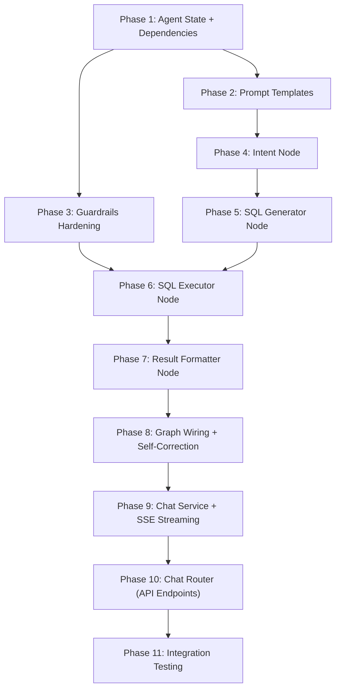
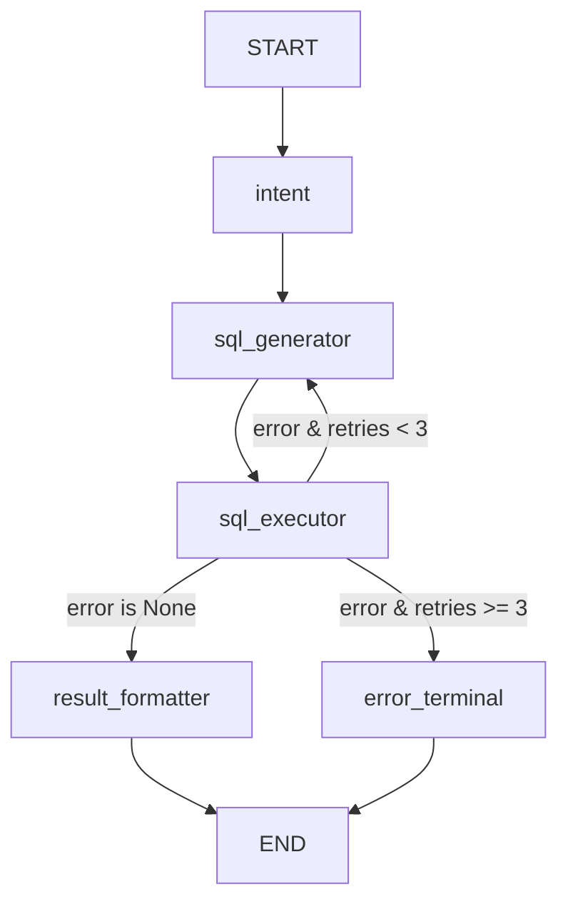

# Implementation Plan: LangGraph NL-to-SQL Agent Workflow

## Overview

Build a robust, modular LangGraph-based agent pipeline that converts natural language questions into SQL, executes them safely against user databases, and returns formatted results. The workflow includes intent classification, vector-based schema retrieval, dialect-aware SQL generation, guardrailed execution, self-correction loops (max 3 retries), NL result formatting, multi-turn memory via PostgreSQL checkpointing, and SSE streaming to the frontend.

All work lives under `backend/app/domain/agent/` (graph + nodes) and `backend/app/domain/chat/` (session management + API endpoints). The existing `ConnectionManager`, `EmbeddingService`, and `SchemaIntrospectionService` are consumed — never directly modified — except for one targeted hardening pass on `ConnectionManager` guardrails.

---

## User Review Required

> [!IMPORTANT]
> **Read-Only Guardrail Strategy** — The current `ConnectionManager._validate_query()` uses a keyword blocklist (`INSERT`, `UPDATE`, `DELETE`, `DROP`, etc.) applied via simple substring matching on lowered SQL. This is a basic first line of defense. The plan proposes layering three additional guardrails:
> 1. **SQL parsing via `sqlglot`** — parse the SQL AST and reject any statement that is not a `SELECT` (catches CTEs, subqueries, semicolon-injection, `CALL`, `EXEC`, etc.)
> 2. **Read-only database role** — recommend users create a read-only PostgreSQL/MySQL user for connections (documented, not enforced)
> 3. **Statement-level `SET TRANSACTION READ ONLY`** — wrap execution in a read-only transaction where the dialect supports it
>
> Please confirm if all three layers are desired, or if the AST-parse alone is sufficient.

> [!IMPORTANT]
> **LLM Provider for Agent Nodes** — The plan uses the existing `get_llm_client()` factory from `app.core.llm`, which supports Anthropic, OpenAI, Groq, and HuggingFace. The agent nodes will use whatever `LLM_PROVIDER` / `LLM_MODEL` is configured in `.env`. Is that acceptable, or do you want separate config keys for the agent (e.g. `AGENT_LLM_PROVIDER`, `AGENT_LLM_MODEL`) so the agent can use a different model than auto-suggest?

> [!WARNING]
> **New Dependency: `langgraph-checkpoint-postgres`** — Required for persistent multi-turn checkpointing. This will add `psycopg[binary]` (Psycopg 3) alongside the existing `asyncpg`. The checkpointer tables are auto-created by `AsyncPostgresSaver.setup()` on startup.

> [!WARNING]
> **New Dependency: `sqlglot`** — Lightweight SQL parser (no network, no heavy deps) for AST-level read-only validation. If you want to avoid adding this dependency, the keyword-blocklist approach alone can be kept as the guardrail.

---

## Open Questions

> [!IMPORTANT]
> **1. SSE vs WebSocket** — The Backend Plan specifies SSE (Server-Sent Events) for streaming intermediate agent progress. SSE is simpler and sufficient for unidirectional streaming. Do you want to stick with SSE, or would you prefer WebSocket for bidirectional communication (e.g. user can cancel mid-stream)?

> [!IMPORTANT]
> **2. Checkpointer Database** — Should the LangGraph checkpoint tables live in the same Platform DB (simplest), or in a separate database? Using the same DB means one fewer connection to manage but adds tables to the platform schema.

> [!IMPORTANT]
> **3. Chat Session ↔ Connection** — The existing `ChatSession` model has a `connection_id` FK, meaning each session is tied to one database connection. Should a user be able to query across multiple connections in one session, or is one-connection-per-session correct?

> [!IMPORTANT]
> **4. `sse-starlette` for SSE** — Should we use the `sse-starlette` package (standard for FastAPI SSE), or implement raw `StreamingResponse` with manual event formatting?

---

## Architecture Decisions

- **LangGraph `StateGraph`** over raw LangChain chains — gives us explicit node-by-node control, conditional edges for self-correction, and built-in checkpointing for multi-turn.
- **`AsyncPostgresSaver`** for checkpointing — uses the same Platform DB, thread_id = `"{session_id}"`, enabling multi-turn memory without additional infrastructure.
- **Node functions are pure `async def`** — each receives `AgentState`, returns a partial state update dict. No side effects beyond calling services.
- **Services injected via a `GraphDependencies` dataclass** — since LangGraph nodes don't support FastAPI DI, we pass a dependency container through state or closure.
- **Prompt templates defined in `agent/prompts.py`** — centralized, versionable, testable prompt strings. No inline prompts in node logic.
- **`sqlglot` for SQL validation** — defense-in-depth above the keyword blocklist. Parses SQL into AST, rejects anything that isn't a pure SELECT.

---

## Dependency Graph



---

## Proposed Changes

### Phase 1: Foundation — Agent State Refinement + Dependency Container

Refine `AgentState` to carry all runtime context and create a dependency injection container for graph nodes.

#### [MODIFY] [state.py](file:///c:/Users/Lenovo/OneDrive/Desktop/Db-chatbot/backend/app/domain/agent/state.py)
- Add `connection_id: UUID` to state (needed by executor to get the right engine)
- Add `sql_dialect: str` field (already exists, ensure populated from Connection model)
- Add `schema_context: str` field — formatted schema text for the LLM prompt
- Add `error_history: list[str]` — accumulates errors across retries for context
- Add `streaming_events: list[dict]` — SSE events emitted during execution
- Keep `messages: Annotated[list[Any], add_messages]` for multi-turn

#### [NEW] [dependencies.py](file:///c:/Users/Lenovo/OneDrive/Desktop/Db-chatbot/backend/app/domain/agent/dependencies.py)
- `GraphDependencies` dataclass holding:
  - `db: AsyncSession`
  - `connection_manager: ConnectionManager`
  - `embedding_service: EmbeddingService`
  - `connection: Connection` (the resolved connection ORM object)
  - `llm: BaseChatModel`
- Factory function `build_graph_dependencies(db, project_id, user_id) -> GraphDependencies`

**Estimated scope:** Small (2 files)

---

### Phase 2: Prompt Templates

Centralize all LLM prompt templates used by agent nodes.

#### [NEW] [prompts.py](file:///c:/Users/Lenovo/OneDrive/Desktop/Db-chatbot/backend/app/domain/agent/prompts.py)
- `INTENT_CLASSIFICATION_PROMPT` — system prompt for intent node (classify query type, extract entities)
- `SQL_GENERATION_PROMPT` — system prompt for SQL generator (takes schema context, dialect, query, returns SQL)
- `SQL_CORRECTION_PROMPT` — system prompt for self-correction (takes previous SQL, error message, schema)
- `RESULT_SUMMARY_PROMPT` — system prompt for NL result formatting (takes SQL, rows, returns summary)
- All prompts use `{placeholder}` style for `.format()` injection

**Estimated scope:** Small (1 file)

---

### Phase 3: Guardrails Hardening — Read-Only Enforcement

Strengthen the SQL execution guardrails to ensure only SELECT operations pass through.

#### [MODIFY] [manager.py](file:///c:/Users/Lenovo/OneDrive/Desktop/Db-chatbot/backend/app/domain/connections/manager.py)
- Layer 1 (existing): keyword blocklist — keep as fast first-pass check
- Layer 2 (new): `sqlglot.parse()` the SQL → reject if root statement is not `SELECT`
- Layer 3 (new): wrap `execute_safe()` in `SET TRANSACTION READ ONLY` where dialect supports it (PostgreSQL)
- Add `asyncio.wait_for()` with `QUERY_TIMEOUT_SECONDS` to `execute_safe()` (currently a TODO)
- Add result serialization — convert non-JSON-serializable types (datetime, Decimal, UUID) to strings

#### [NEW] [sql_validator.py](file:///c:/Users/Lenovo/OneDrive/Desktop/Db-chatbot/backend/app/domain/agent/sql_validator.py)
- `validate_read_only(sql: str) -> None` — `sqlglot`-based AST validation
- `sanitize_sql(sql: str) -> str` — strip trailing semicolons, comments, normalize whitespace
- `extract_tables_from_sql(sql: str) -> list[str]` — extract table names for audit logging

**Estimated scope:** Small (2 files)

---

### Phase 4: Intent Node — Query Classification + Schema Retrieval

Implement the first node in the pipeline.

#### [MODIFY] [intent.py](file:///c:/Users/Lenovo/OneDrive/Desktop/Db-chatbot/backend/app/domain/agent/nodes/intent.py)
- `async def intent_node(state: AgentState) -> dict` — partial state update
- Step 1: Call LLM with `INTENT_CLASSIFICATION_PROMPT` + user query → classify intent type, extract entities
- Step 2: Use `EmbeddingService.search_schema()` with user query → retrieve top-k relevant columns/tables
- Step 3: Format retrieved schema into `schema_context` string (table names, columns, types, descriptions, FKs)
- Return: `{intent_type, extracted_entities, relevant_schema, schema_context}`
- Emit SSE event: `intent_classified`

**Acceptance criteria:**
- Correctly classifies into: `lookup`, `aggregation`, `comparison`, `trend`, `general`
- Retrieved schema is scoped to `project_id` and relevant to the query
- Works with all configured LLM providers

**Estimated scope:** Medium (1 file + tests)

---

### Phase 5: SQL Generator Node — Dialect-Aware SQL Generation

#### [MODIFY] [sql_generator.py](file:///c:/Users/Lenovo/OneDrive/Desktop/Db-chatbot/backend/app/domain/agent/nodes/sql_generator.py)
- `async def sql_generator_node(state: AgentState) -> dict`
- Builds prompt from: `SQL_GENERATION_PROMPT` (first attempt) or `SQL_CORRECTION_PROMPT` (retry)
- Includes: `schema_context`, `sql_dialect`, `user_query`, `intent_type`, `error_history` (on retry)
- Includes: `messages` history for multi-turn context
- Parses LLM response to extract clean SQL (strip markdown fences, comments)
- Return: `{generated_sql}`
- Emit SSE event: `sql_generated`

**Acceptance criteria:**
- Generates syntactically valid SQL for the target dialect
- On retry, incorporates previous error message to fix the SQL
- Respects dialect differences (e.g. `LIMIT` vs `TOP`, quoting rules)

**Estimated scope:** Medium (1 file + tests)

---

### Phase 6: SQL Executor Node — Guardrailed Execution

#### [MODIFY] [sql_executor.py](file:///c:/Users/Lenovo/OneDrive/Desktop/Db-chatbot/backend/app/domain/agent/nodes/sql_executor.py)
- `async def sql_executor_node(state: AgentState) -> dict`
- Step 1: Validate SQL via `validate_read_only()` + `ConnectionManager._validate_query()`
- Step 2: Get session from `ConnectionManager` using state's `connection_id`
- Step 3: Execute via `ConnectionManager.execute_safe()` with timeout
- Step 4: On success → `{execution_result, execution_error: None}`
- Step 5: On error → `{execution_result: [], execution_error: str, retry_count: +1, error_history: [..., error]}`
- Emit SSE event: `sql_executed` (success) or `sql_error` (failure)

**Acceptance criteria:**
- Blocks any non-SELECT statement (DDL/DML/DCL)
- Enforces 10s timeout and 1000-row cap
- Passes error details back for self-correction

**Estimated scope:** Medium (1 file + tests)

---

### Phase 7: Result Formatter Node — NL Summary Generation

#### [MODIFY] [result_formatter.py](file:///c:/Users/Lenovo/OneDrive/Desktop/Db-chatbot/backend/app/domain/agent/nodes/result_formatter.py)
- `async def result_formatter_node(state: AgentState) -> dict`
- Call LLM with `RESULT_SUMMARY_PROMPT` + query + SQL + first N rows
- Return: `{nl_summary}` — plain-English explanation of the results
- Handle edge cases: empty results, single row, large result sets (summarize, don't enumerate)
- Emit SSE event: `result_formatted`

**Acceptance criteria:**
- Produces a human-readable summary that answers the original question
- Handles zero-row results gracefully

**Estimated scope:** Small (1 file + tests)

---

### Phase 8: Graph Wiring — StateGraph + Self-Correction Loop + Checkpointing

Wire all nodes into a LangGraph `StateGraph` with conditional edges and persistent checkpointing.

#### [MODIFY] [graph.py](file:///c:/Users/Lenovo/OneDrive/Desktop/Db-chatbot/backend/app/domain/agent/graph.py)
- `build_agent_graph(checkpointer) -> CompiledGraph`
- Node registration: `intent` → `sql_generator` → `sql_executor` → (conditional) → `result_formatter`
- Conditional edge after `sql_executor`:
  - If `execution_error is None` → `result_formatter`
  - If `execution_error and retry_count < 3` → `sql_generator` (retry)
  - If `execution_error and retry_count >= 3` → `error_terminal` (fail gracefully)
- Entry point: `intent`
- Compile with `AsyncPostgresSaver` checkpointer

#### [NEW] [error_terminal.py](file:///c:/Users/Lenovo/OneDrive/Desktop/Db-chatbot/backend/app/domain/agent/nodes/error_terminal.py)
- `async def error_terminal_node(state: AgentState) -> dict`
- Formats a user-friendly error message explaining the failure after max retries
- Return: `{nl_summary: "I wasn't able to answer your question because..."}`



**Acceptance criteria:**
- Self-correction loop runs max 3 times
- Checkpointer persists state between invocations (multi-turn)
- Graph can be visualized with `graph.get_graph().draw_mermaid()`

**Estimated scope:** Medium (2 files)

---

### Phase 9: Chat Service — Session Management + Agent Invocation + SSE

Implement the chat service that orchestrates session CRUD and agent graph invocation.

#### [MODIFY] [services.py](file:///c:/Users/Lenovo/OneDrive/Desktop/Db-chatbot/backend/app/domain/chat/services.py)
- `ChatService` class with:
  - `create_session(project_id, connection_id, title) -> ChatSession`
  - `list_sessions(project_id, skip, limit) -> tuple[list[ChatSession], int]`
  - `get_session(project_id, session_id) -> ChatSession`
  - `delete_session(project_id, session_id) -> None`
  - `send_message(project_id, session_id, content) -> AsyncGenerator[dict, None]`
    - Saves user `ChatMessage`
    - Builds `AgentState` from session context
    - Invokes LangGraph graph with `thread_id = str(session_id)`
    - Streams SSE events as the graph progresses
    - Saves assistant `ChatMessage` + `QueryRun` record on completion
- `get_chat_service()` FastAPI dependency provider

#### [MODIFY] [repository.py](file:///c:/Users/Lenovo/OneDrive/Desktop/Db-chatbot/backend/app/domain/chat/repository.py)
- `ChatRepository` extending `CRUDBase` for `ChatSession`
- `ChatMessageRepository` for message persistence
- `QueryRunRepository` for query attempt tracking

#### [MODIFY] [schemas.py](file:///c:/Users/Lenovo/OneDrive/Desktop/Db-chatbot/backend/app/domain/chat/schemas.py)
- Add `connection_id` to `ChatSessionCreate`
- Add `ChatSessionDetailResponse` with message count
- Add `QueryRunResponse` schema
- Add `SSEEvent` schema for typed streaming events
- Enrich `ChatMessageResponse` with `query_run` nested data

**Estimated scope:** Large (3 files)

---

### Phase 10: Chat Router — API Endpoints with SSE

#### [MODIFY] [router.py](file:///c:/Users/Lenovo/OneDrive/Desktop/Db-chatbot/backend/app/domain/chat/router.py)
- `POST /{project_id}/chat/sessions` — Create chat session
- `GET /{project_id}/chat/sessions` — List sessions (paginated)
- `GET /{project_id}/chat/sessions/{session_id}` — Get session with messages
- `DELETE /{project_id}/chat/sessions/{session_id}` — Delete session
- `POST /{project_id}/chat/sessions/{session_id}/messages` — Send message (returns SSE stream)
- `GET /{project_id}/chat/sessions/{session_id}/messages` — Get message history (paginated)

#### [MODIFY] [main.py](file:///c:/Users/Lenovo/OneDrive/Desktop/Db-chatbot/backend/app/main.py)
- Uncomment and register chat router
- Add `AsyncPostgresSaver.setup()` to lifespan startup
- Add checkpointer disposal to lifespan shutdown

#### [MODIFY] [requirements.txt](file:///c:/Users/Lenovo/OneDrive/Desktop/Db-chatbot/backend/requirements.txt)
- Add `langgraph-checkpoint-postgres`
- Add `psycopg[binary]`
- Add `sqlglot`
- Add `sse-starlette`

**Estimated scope:** Medium (3 files)

---

### Phase 11: Integration Testing

#### [NEW] tests/domain/agent/test_sql_validator.py
- Test `validate_read_only()` accepts SELECT, rejects INSERT/UPDATE/DELETE/DROP/ALTER/CREATE/CALL/EXEC
- Test semicolon injection: `SELECT 1; DROP TABLE users` → rejected
- Test CTE queries: `WITH ... AS (...) SELECT ...` → accepted

#### [NEW] tests/domain/agent/test_graph.py
- Test full graph execution with mocked LLM + mocked ConnectionManager
- Test self-correction loop fires on SQL error and retries
- Test max retry limit reached → error_terminal

#### [NEW] tests/domain/agent/test_nodes.py
- Unit tests for each node with mocked dependencies

#### [NEW] tests/domain/chat/test_chat_service.py
- Test session CRUD
- Test message send triggers graph invocation

**Estimated scope:** Large (4 files)

---

## Verification Plan

### Automated Tests
```bash
# Unit tests for SQL validator
pytest tests/domain/agent/test_sql_validator.py -v

# Unit tests for individual nodes
pytest tests/domain/agent/test_nodes.py -v

# Integration test for full graph
pytest tests/domain/agent/test_graph.py -v

# Chat service tests
pytest tests/domain/chat/test_chat_service.py -v

# Full test suite
pytest tests/ -v

# Linting and type checking
ruff check .
pyright
```

### Manual Verification
- Send a natural language query via the SSE endpoint and verify:
  1. Intent classification event is streamed
  2. SQL generation event is streamed with correct dialect
  3. SQL execution event is streamed with results
  4. NL summary event is streamed
  5. Messages are persisted to `chat_messages` table
  6. QueryRun records are persisted with status and latency
- Send a follow-up question in the same session → verify multi-turn context works
- Verify blocked operations: attempt to craft a query that would trigger DML → confirm rejection
- Verify timeout: send a query that would take >10s → confirm timeout error

---

## Risks and Mitigations

| Risk | Impact | Mitigation |
|------|--------|------------|
| LLM generates unsafe SQL despite guardrails | **Critical** | Three-layer defense: keyword blocklist + AST parse + read-only transaction. Never trust LLM output. |
| `sqlglot` doesn't support all SQL dialects perfectly | Medium | Fall back to keyword blocklist if AST parse fails; log warning. `sqlglot` supports PostgreSQL, MySQL, SQLite, MSSQL, Snowflake. |
| Checkpoint table growth in Platform DB | Medium | Implement periodic cleanup job (future task). Document `LANGGRAPH_STRICT_MSGPACK=true` for security. |
| LLM latency causes SSE timeout | Medium | Set reasonable timeouts per node. Use streaming LLM calls where possible. |
| Self-correction loop produces worse SQL on retry | Low | Include full error history in retry prompt. Cap at 3 retries. Error terminal provides graceful failure message. |
| Multi-turn context window overflow | Low | Limit message history sent to LLM (last N messages). LangGraph checkpointing handles full history storage. |

---

## Task Summary

| Phase | Task | Files | Size | Depends On |
|-------|------|-------|------|------------|
| 1 | Agent State + Dependencies | 2 | S | None |
| 2 | Prompt Templates | 1 | S | None |
| 3 | Guardrails Hardening | 2 | S | None |
| 4 | Intent Node | 1 | M | 1, 2 |
| 5 | SQL Generator Node | 1 | M | 2 |
| 6 | SQL Executor Node | 1 | M | 3 |
| 7 | Result Formatter Node | 1 | S | 2 |
| 8 | Graph Wiring + Self-Correction | 2 | M | 4, 5, 6, 7 |
| 9 | Chat Service + SSE | 3 | L | 8 |
| 10 | Chat Router + Registration | 3 | M | 9 |
| 11 | Integration Testing | 4 | L | 10 |
