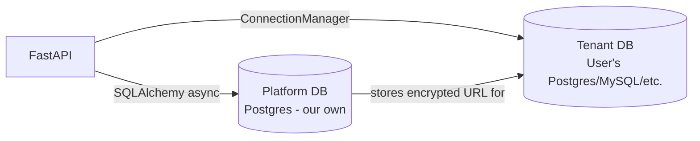
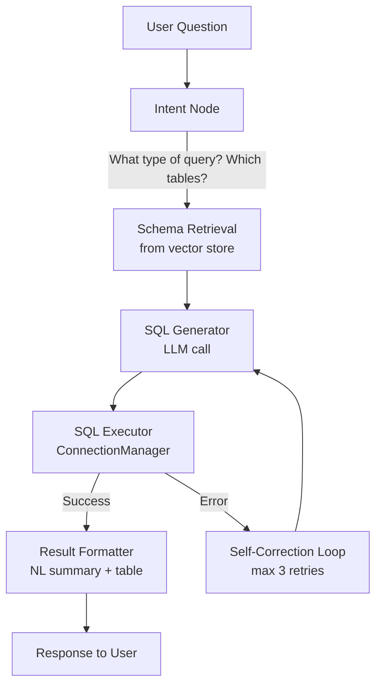

# Backend Plan — Full Explanation

## The Big Picture (What are we building?)

A backend API that lets a user:
1. **Connect** any database (PostgreSQL, MySQL, etc.) by pasting a connection string.
2. **Ask a question in plain English** — e.g. *"What were the top 5 products by revenue last month?"*
3. **Get back** the correct SQL, the raw results as a table, and a plain-English summary.

Everything is multi-tenant: one backend, many users, each with their own isolated projects and databases.

---

## Two Databases — A Critical Distinction

This is the most important concept to understand first.

| | Platform DB | Tenant DB |
|---|---|---|
| **What it is** | Our own PostgreSQL (managed by us) | The user's database (could be anything) |
| **What it stores** | Projects, connections, schema cache, chat history | The user's actual business data |
| **Who connects to it** | FastAPI via SQLAlchemy (async, always on) | `ConnectionManager` only, on demand |
| **Connection** | `DATABASE_URL` in `.env` | Encrypted string stored in Platform DB |
| **ORM models** | `Project`, `Connection`, `SchemaCache`, etc. | None — we just run SELECT queries |

> [!IMPORTANT]
> The user's database connection string is **encrypted with Fernet** before being saved to our Platform DB. It is **decrypted in one place only** — inside `ConnectionManager`. It is **never logged**, never returned in an API response.



---

## Folder Structure — What Each Piece Does

```
backend/
├── app/
│   ├── main.py           ← App entry point. Starts FastAPI, mounts all routers.
│   │
│   ├── core/             ← Shared infrastructure (no business logic here)
│   │   ├── config.py     ← Reads all env vars (.env file) into a Settings object.
│   │   ├── db.py         ← Creates the SQLAlchemy engine + get_db() dependency.
│   │   └── security.py   ← encrypt() / decrypt() for connection strings. That's it.
│   │
│   └── domain/           ← Business logic, split by feature area
│       ├── projects/
│       ├── connections/
│       ├── schema_introspection/
│       ├── semantic_layer/
│       ├── agent/
│       └── chat/
│
├── alembic/              ← Database migrations (how our Platform DB schema evolves)
└── tests/                ← Automated tests
```

### The "domain" pattern — every domain has the same 5 files

Each domain folder (e.g. `projects/`) contains:

| File | Role | Analogy |
|---|---|---|
| `models.py` | SQLAlchemy ORM table definition | The database table |
| `schemas.py` | Pydantic shapes for API input/output | The API contract |
| `repository.py` | Raw DB queries (SELECT, INSERT, etc.) | The data access layer |
| `services.py` | Business logic, orchestration | The brain |
| `router.py` | FastAPI HTTP endpoints | The door |

**Data flows in one direction only:**

```
HTTP Request → router.py → services.py → repository.py → database
                                ↑
                           schemas.py (validates input/output)
                           models.py  (ORM shape)
```

> [!NOTE]
> Domains **never** import from each other's `models.py` or `repository.py` directly.
> Cross-domain communication only happens through `services.py` or `core/`.

---

## The 6 Domain Modules Explained

### 1. `projects/` — The Root Entity
Every single thing in the system belongs to a **Project**. It's the isolation boundary.
- A project has a name and a description.
- When you delete a project, everything under it (connections, schema caches, chat sessions) cascades and deletes too.
- **Fully implemented now** — CRUD endpoints are ready.

### 2. `connections/` — Storing User Database Credentials
- User submits: `{ name: "My DB", dialect: "postgresql", connection_string: "postgresql://..." }`
- Service **encrypts** the connection string via `core/security.py`.
- Stores only the encrypted blob in the `connections` table — **never the plaintext**.
- Response back to user **never includes** the connection string (not even encrypted).
- The `manager.py` file inside here is the `ConnectionManager` — it's where pooled engines live.

### 3. `schema_introspection/` — Auto-discovering the User's DB Structure
- After a connection is saved, we connect to the user's DB and **read its structure** (tables, columns, types, primary keys, foreign keys) using SQLAlchemy's `inspect()`.
- This gets saved as JSON into our `schema_caches` table in the Platform DB.
- Why cache it? Because we don't want to re-introspect the user's DB on every query — that would be slow.

### 4. `semantic_layer/` — Optional Business Context
- By default, the AI only knows column names like `ord_dt`, `cust_id`, etc.
- This domain lets users add descriptions: *"ord_dt means order date"*, *"use this join to connect orders to customers"*.
- Stored as flexible JSON in `semantic_metadata` table.
- These descriptions get **embedded into vectors** so the AI can find the right tables even for vague questions.

### 5. `agent/` — The AI Brain (LangGraph Pipeline)
This is the core. When a user sends a message, this pipeline runs:



- **Intent Node** — classifies the question (lookup? aggregation? trend?) and finds the relevant tables from the schema cache using vector search.
- **SQL Generator** — sends the question + relevant schema to Claude (Anthropic LLM) to produce dialect-correct SQL.
- **SQL Executor** — runs the SQL via `ConnectionManager` with read-only guardrails, 10s timeout, 1000-row cap.
- **Self-Correction** — if the SQL fails (syntax error, wrong column name), the error is fed back to the SQL Generator and it tries again (max 3 times).
- **Result Formatter** — turns the raw rows into a plain-English summary + structured table.

The state of each step is tracked in `agent/state.py` (the `AgentState` object that flows through the graph).

### 6. `chat/` — Multi-turn Conversations
- Each conversation is a **ChatSession** (belongs to a Project).
- Multi-turn memory works because LangGraph **checkpoints** the agent state to PostgreSQL after each message.
- So when you ask *"now filter that by last month"*, the agent knows what *"that"* refers to.
- The endpoint streams intermediate progress back to the frontend via **SSE (Server-Sent Events)** — so users see "Generating SQL..." before they see the final answer.

---

## The Implementation Phases (What We Build When)

```mermaid
gantt
    title Backend Build Plan
    dateFormat  X
    axisFormat Phase %s

    section Phase 0 - Foundations
    Project CRUD API         :done, p0a, 0, 1
    Connection save+encrypt  :p0b, 0, 1
    Alembic migrations       :p0c, 0, 1

    section Phase 1 - Schema
    DB introspection         :p1a, 1, 2
    Schema cache             :p1b, 1, 2

    section Phase 2 - Semantic
    Business descriptions    :p2a, 2, 3
    Vector embeddings        :p2b, 2, 3

    section Phase 3 - Agent
    LangGraph pipeline       :p3a, 3, 5
    SSE streaming            :p3b, 3, 5
    Self-correction loop     :p3c, 3, 5

    section Phase 4 - Memory
    LangGraph checkpointing  :p4a, 5, 6

    section Phase 5 - Polish
    NL result summaries      :p5a, 6, 7
```



| Phase | What Gets Built | Status |
|---|---|---|
| **Phase 0** | Repo structure ✅, Projects API ✅, Connections API (encryption + save), Alembic migrations | 🔨 Now |
| **Phase 1** | Schema introspection — connect to user's DB, read tables/columns, cache to Platform DB | Next |
| **Phase 2** | Semantic layer — editable descriptions + vector embeddings for schema linking | After |
| **Phase 3** | Core agent graph — Intent → SQL → Execute → Self-correct → Format, SSE streaming | Core work |
| **Phase 4** | Multi-turn memory — LangGraph PostgreSQL checkpointing | After agent |
| **Phase 5** | Natural language result summaries, chart suggestions | Final polish |

---

## The Request Lifecycle (End to End)

Here's what happens when a user asks *"What are my top 10 customers by total orders?"*:

```
1. POST /api/v1/projects/{project_id}/sessions/{session_id}/messages
   body: { "content": "What are my top 10 customers by total orders?" }

2. ChatService receives it → invokes LangGraph agent graph

3. Intent Node
   → classifies: "aggregation"
   → retrieves from vector store: ["customers table", "orders table"]

4. SQL Generator (Claude LLM call)
   → produces: SELECT c.name, COUNT(o.id) as total_orders
                FROM customers c JOIN orders o ON c.id = o.customer_id
                GROUP BY c.name ORDER BY total_orders DESC LIMIT 10

5. SQL Executor (ConnectionManager)
   → validates: no DDL/DML keywords ✅
   → executes on user's DB with 10s timeout, 1000-row cap
   → returns 10 rows

6. Result Formatter (Claude LLM call)
   → produces NL summary: "Your top customer is Acme Corp with 342 orders..."

7. SSE stream sends intermediate events to frontend:
   → "intent_classified" event
   → "sql_generated" event
   → "sql_executed" event
   → "final_result" event (with SQL + rows + summary)

8. ChatMessage saved to Platform DB (scoped by project_id + session_id)
```

---

## Security Rules (Non-negotiable)

| Rule | Where enforced |
|---|---|
| Connection strings encrypted before DB insert | `connections/services.py` → `core/security.py` |
| Connection strings decrypted only for execution | `connections/manager.py` only |
| Raw credentials never logged | `core/security.py` (no logging of plaintext) |
| All queries scoped by `project_id` | Every repository method |
| Only SELECT allowed on tenant DBs | `ConnectionManager._validate_query()` |
| Max 1000 rows returned | `ConnectionManager.execute_safe()` |
| 10 second query timeout | `ConnectionManager.execute_safe()` (TODO: Phase 3) |
