# Database Schema — Natural Language Database Querying Platform

> **Isolation model**: Row-level, `project_id` FK on every sub-resource table.
> **Platform DB**: PostgreSQL 15+ with `pgvector` extension.
> **Auth**: Email/password authentication — `users` table, bcrypt-hashed passwords, JWT access tokens.
> **LangGraph checkpoints**: Managed by `AsyncPostgresSaver.setup()`, outside Alembic.

---

## ER Diagram

```mermaid
erDiagram
    users {
        uuid        id              PK
        varchar255  email
        varchar255  hashed_password
        boolean     is_active
        timestamptz created_at
        timestamptz updated_at
    }

    projects {
        uuid        id              PK
        uuid        owner_id        FK
        varchar255  name
        varchar1024 description
        timestamptz created_at
        timestamptz updated_at
    }

    connections {
        uuid        id                          PK
        uuid        project_id                  FK
        varchar255  name
        varchar50   dialect
        varchar2048 encrypted_connection_string
        timestamptz created_at
        timestamptz updated_at
    }

    schema_cache {
        uuid        id              PK
        uuid        connection_id   FK
        uuid        project_id      FK
        timestamptz introspected_at
        jsonb       raw_schema
        timestamptz created_at
        timestamptz updated_at
    }

    schema_tables {
        uuid        id          PK
        uuid        cache_id    FK
        uuid        connection_id FK
        uuid        project_id  FK
        varchar255  schema_name
        varchar255  table_name
        timestamptz created_at
    }

    schema_columns {
        uuid        id              PK
        uuid        table_id        FK
        uuid        connection_id   FK
        uuid        project_id      FK
        varchar255  column_name
        varchar100  data_type
        boolean     is_nullable
        boolean     is_primary_key
        boolean     is_foreign_key
        varchar255  fk_target_table
        varchar255  fk_target_column
        int         ordinal_position
        timestamptz created_at
    }

    schema_annotations {
        uuid        id               PK
        uuid        project_id       FK
        uuid        connection_id    FK
        uuid        schema_table_id  FK "nullable"
        uuid        schema_column_id FK "nullable"
        varchar10   target_type
        text        note
        timestamptz created_at
        timestamptz updated_at
    }

    schema_embeddings {
        uuid        id               PK
        uuid        schema_column_id FK
        uuid        connection_id    FK
        uuid        project_id       FK
        vector1536  embedding
        text        embed_text
        varchar100  model
        timestamptz created_at
        timestamptz updated_at
    }

    chat_sessions {
        uuid        id            PK
        uuid        project_id    FK
        uuid        connection_id FK
        varchar500  title
        timestamptz created_at
        timestamptz updated_at
    }

    chat_messages {
        uuid        id           PK
        uuid        session_id   FK
        uuid        project_id   FK
        varchar20   role
        text        content
        int         token_count
        jsonb       metadata
        uuid        query_run_id FK "nullable"
        timestamptz created_at
    }

    query_runs {
        uuid        id               PK
        uuid        chat_message_id  FK
        uuid        project_id       FK
        uuid        connection_id    FK
        int         attempt_number
        uuid        parent_run_id    FK "nullable self-ref"
        text        nl_prompt
        text        generated_sql
        varchar30   status
        text        error_message
        text        result_summary
        int         result_row_count
        int         latency_ms
        timestamptz created_at
        timestamptz updated_at
    }

    users            ||--o{  projects         : "owns"
    projects         ||--||  connections      : "owns one"
    projects         ||--o{  chat_sessions    : "has"
    connections      ||--||  schema_cache     : "has one"
    schema_cache     ||--o{  schema_tables    : "contains"
    schema_tables    ||--o{  schema_columns   : "has"
    schema_tables    ||--o{  schema_annotations : "annotated by"
    schema_columns   ||--o{  schema_annotations : "annotated by"
    schema_columns   ||--o|  schema_embeddings: "embedded as"
    chat_sessions    ||--o{  chat_messages    : "contains"
    chat_messages    ||--o{  query_runs       : "triggers"
    query_runs       ||--o|  query_runs       : "retried as"
    connections      ||--o{  chat_sessions    : "used in"
    connections      ||--o{  query_runs       : "executed on"
```



---

## Table Reference

### `users`
Platform user account. Owns one or many `projects`.

| Column | Type | Constraints |
|---|---|---|
| `id` | `UUID` | PK, default `uuid_generate_v4()` |
| `email` | `VARCHAR(255)` | NOT NULL, **UNIQUE** |
| `hashed_password` | `VARCHAR(255)` | NOT NULL — bcrypt hash, never stored or logged raw |
| `is_active` | `BOOLEAN` | NOT NULL, default `true` |
| `created_at` | `TIMESTAMPTZ` | NOT NULL, `server_default=now()` |
| `updated_at` | `TIMESTAMPTZ` | NOT NULL, `server_default=now()`, `onupdate=now()` |

**Index:** `UNIQUE(email)` — login lookup.

> 🔒 Raw password is **never** stored. Hash with `passlib` bcrypt before INSERT. The JWT `sub` claim carries `user.id` (UUID string).

---

### `projects`
Root multi-tenant isolation boundary. Scoped to one `owner_id`.

| Column | Type | Constraints |
|---|---|---|
| `id` | `UUID` | PK, default `uuid_generate_v4()` |
| `owner_id` | `UUID` | FK → `users.id` CASCADE, NOT NULL, indexed |
| `name` | `VARCHAR(255)` | NOT NULL |
| `description` | `VARCHAR(1024)` | NULL |
| `created_at` | `TIMESTAMPTZ` | NOT NULL, `server_default=now()` |
| `updated_at` | `TIMESTAMPTZ` | NOT NULL, `server_default=now()`, `onupdate=now()` |

**Index:** `(owner_id)` — user's project list query.

### `connections`
Encrypted credentials for a target database. **One per project** (`UNIQUE(project_id)`).

| Column | Type | Constraints |
|---|---|---|
| `id` | `UUID` | PK |
| `project_id` | `UUID` | FK → `projects.id` CASCADE, **UNIQUE**, NOT NULL, indexed |
| `name` | `VARCHAR(255)` | NOT NULL |
| `dialect` | `VARCHAR(50)` | NOT NULL — `postgresql`, `mysql`, `mssql`, `snowflake` |
| `encrypted_connection_string` | `VARCHAR(2048)` | NOT NULL — Fernet-encrypted, never returned in responses |
| `created_at` | `TIMESTAMPTZ` | NOT NULL |
| `updated_at` | `TIMESTAMPTZ` | NOT NULL |

> 🔒 Raw connection string never stored. Encrypt with `app.core.security.encrypt()` before INSERT.

---

### `schema_cache`
Header row for one introspection run. **One per connection** (`UNIQUE(connection_id)`); overwritten on re-introspect.

| Column | Type | Constraints |
|---|---|---|
| `id` | `UUID` | PK |
| `connection_id` | `UUID` | FK → `connections.id` CASCADE, **UNIQUE**, NOT NULL, indexed |
| `project_id` | `UUID` | FK → `projects.id` CASCADE, NOT NULL, indexed |
| `introspected_at` | `TIMESTAMPTZ` | NOT NULL |
| `raw_schema` | `JSONB` | NOT NULL — full dialect-reflected dump |
| `created_at` | `TIMESTAMPTZ` | NOT NULL |
| `updated_at` | `TIMESTAMPTZ` | NOT NULL |

---

### `schema_tables`
Normalized table list extracted from `schema_cache`.

| Column | Type | Constraints |
|---|---|---|
| `id` | `UUID` | PK |
| `cache_id` | `UUID` | FK → `schema_cache.id` CASCADE, NOT NULL |
| `connection_id` | `UUID` | FK → `connections.id` CASCADE, NOT NULL, indexed |
| `project_id` | `UUID` | FK → `projects.id` CASCADE, NOT NULL, indexed |
| `schema_name` | `VARCHAR(255)` | NULL — e.g. `public`, `dbo` |
| `table_name` | `VARCHAR(255)` | NOT NULL |
| `created_at` | `TIMESTAMPTZ` | NOT NULL |

**Unique:** `(connection_id, schema_name, table_name)`

---

### `schema_columns`
Normalized column list extracted from `schema_cache`. Primary lookup target for vector retrieval.

| Column | Type | Constraints |
|---|---|---|
| `id` | `UUID` | PK |
| `table_id` | `UUID` | FK → `schema_tables.id` CASCADE, NOT NULL, indexed |
| `connection_id` | `UUID` | FK → `connections.id` CASCADE, NOT NULL, indexed |
| `project_id` | `UUID` | FK → `projects.id` CASCADE, NOT NULL, indexed |
| `column_name` | `VARCHAR(255)` | NOT NULL |
| `data_type` | `VARCHAR(100)` | NOT NULL |
| `is_nullable` | `BOOLEAN` | NOT NULL, default `true` |
| `is_primary_key` | `BOOLEAN` | NOT NULL, default `false` |
| `is_foreign_key` | `BOOLEAN` | NOT NULL, default `false` |
| `fk_target_table` | `VARCHAR(255)` | NULL |
| `fk_target_column` | `VARCHAR(255)` | NULL |
| `ordinal_position` | `INTEGER` | NOT NULL |
| `created_at` | `TIMESTAMPTZ` | NOT NULL |

**Index:** `(connection_id, table_id)` for schema linker queries.

---

### `schema_annotations`
User notes attached to a table or column row surfaced in the **Schema Explorer** UI after scanning.
One row = one note on one target (table **or** column — not both).

| Column | Type | Constraints |
|---|---|---|
| `id` | `UUID` | PK |
| `project_id` | `UUID` | FK → `projects.id` CASCADE, NOT NULL, indexed |
| `connection_id` | `UUID` | FK → `connections.id` CASCADE, NOT NULL, indexed |
| `schema_table_id` | `UUID` | FK → `schema_tables.id` CASCADE, NULL — set when annotating a table |
| `schema_column_id` | `UUID` | FK → `schema_columns.id` CASCADE, NULL — set when annotating a column |
| `target_type` | `VARCHAR(10)` | NOT NULL — `table` \| `column` |
| `note` | `TEXT` | NOT NULL — free-form user note |
| `created_at` | `TIMESTAMPTZ` | NOT NULL |
| `updated_at` | `TIMESTAMPTZ` | NOT NULL |

**CHECK constraint:**
```sql
CHECK (
  (target_type = 'table'  AND schema_table_id  IS NOT NULL AND schema_column_id IS NULL) OR
  (target_type = 'column' AND schema_column_id IS NOT NULL AND schema_table_id  IS NULL)
)
```

> **UI behaviour**: after a DB scan, the Schema Explorer renders `schema_tables` and `schema_columns` as a browsable spreadsheet. Each row has an inline "Add note" field that creates/updates a `schema_annotations` row. Multiple notes per table or column are allowed.

---

### `schema_embeddings`
pgvector embeddings for column-level semantic search. One row per `schema_column`.

| Column | Type | Constraints |
|---|---|---|
| `id` | `UUID` | PK |
| `schema_column_id` | `UUID` | FK → `schema_columns.id` CASCADE, **UNIQUE**, NOT NULL |
| `connection_id` | `UUID` | FK → `connections.id` CASCADE, NOT NULL, indexed |
| `project_id` | `UUID` | FK → `projects.id` CASCADE, NOT NULL, indexed |
| `embedding` | `vector(1536)` | NOT NULL — `text-embedding-3-small` |
| `embed_text` | `TEXT` | NOT NULL — the string that was embedded |
| `model` | `VARCHAR(100)` | NOT NULL, default `text-embedding-3-small` |
| `created_at` | `TIMESTAMPTZ` | NOT NULL |
| `updated_at` | `TIMESTAMPTZ` | NOT NULL |

**Index:** `USING ivfflat (embedding vector_cosine_ops) WITH (lists = 100)` — scoped per `connection_id` in queries.

> The `embed_text` string format: `"{schema_name}.{table_name}.{column_name} ({data_type}) | Notes: {concatenated annotation notes}"` — introspected type enriched with any user notes at re-embed time.

---

### `chat_sessions`
Multi-turn conversation context for a project+connection pair.

| Column | Type | Constraints |
|---|---|---|
| `id` | `UUID` | PK |
| `project_id` | `UUID` | FK → `projects.id` CASCADE, NOT NULL, indexed |
| `connection_id` | `UUID` | FK → `connections.id` CASCADE, NOT NULL, indexed |
| `title` | `VARCHAR(500)` | NULL — auto-generated from first message |
| `created_at` | `TIMESTAMPTZ` | NOT NULL |
| `updated_at` | `TIMESTAMPTZ` | NOT NULL |

**Index:** `(project_id, created_at DESC)` for session list queries.

---

### `chat_messages`
Individual turns within a session. Assistant messages link to their final `query_run`.

| Column | Type | Constraints |
|---|---|---|
| `id` | `UUID` | PK |
| `session_id` | `UUID` | FK → `chat_sessions.id` CASCADE, NOT NULL, indexed |
| `project_id` | `UUID` | FK → `projects.id` CASCADE, NOT NULL, indexed |
| `role` | `VARCHAR(20)` | NOT NULL — `user` \| `assistant` \| `system` |
| `content` | `TEXT` | NOT NULL |
| `token_count` | `INTEGER` | NULL |
| `metadata` | `JSONB` | NULL — tool calls, citations, intent classification |
| `query_run_id` | `UUID` | FK → `query_runs.id` SET NULL, NULL — links assistant message to its final successful run |
| `created_at` | `TIMESTAMPTZ` | NOT NULL |

**Index:** `(session_id, created_at ASC)` for message history queries.

> `query_run_id` is set after the agent graph completes. The FK is `DEFERRABLE INITIALLY DEFERRED` to resolve the circular dependency with `query_runs`.

---

### `query_runs`
One row per SQL generation attempt. Supports the self-correction retry chain.

| Column | Type | Constraints |
|---|---|---|
| `id` | `UUID` | PK |
| `chat_message_id` | `UUID` | FK → `chat_messages.id` CASCADE, NOT NULL, indexed |
| `project_id` | `UUID` | FK → `projects.id` CASCADE, NOT NULL, indexed |
| `connection_id` | `UUID` | FK → `connections.id` CASCADE, NOT NULL, indexed |
| `attempt_number` | `INTEGER` | NOT NULL, default `1` |
| `parent_run_id` | `UUID` | FK → `query_runs.id` SET NULL, NULL — previous attempt in retry chain |
| `nl_prompt` | `TEXT` | NOT NULL — the original NL question |
| `generated_sql` | `TEXT` | NULL — populated after SQL generation node |
| `status` | `VARCHAR(30)` | NOT NULL, default `pending` — see enum below |
| `error_message` | `TEXT` | NULL — DB error from failed execution |
| `result_summary` | `TEXT` | NULL — NL summary produced by Result Formatter |
| `result_row_count` | `INTEGER` | NULL — rows returned by execution |
| `latency_ms` | `INTEGER` | NULL — end-to-end agent graph latency |
| `created_at` | `TIMESTAMPTZ` | NOT NULL |
| `updated_at` | `TIMESTAMPTZ` | NOT NULL |

**Status enum:** `pending` → `running` → `success` | `correcting` → `running` (retry) | `failed` | `cancelled` | `timeout`

**Indexes:** `(chat_message_id)`, `(status)`, `(project_id, created_at DESC)`

---

## Index Summary

| Table | Index | Type | Purpose |
|---|---|---|---|
| `users` | `(email)` | UNIQUE BTREE | Login lookup |
| `projects` | `(owner_id)` | BTREE | User's project list |
| `connections` | `(project_id)` | UNIQUE BTREE | Enforce one-per-project |
| `schema_cache` | `(connection_id)` | UNIQUE BTREE | Enforce one-per-connection |
| `schema_columns` | `(connection_id, table_id)` | BTREE | Schema linker batch lookups |
| `schema_embeddings` | `(embedding)` | IVFFlat cosine | ANN vector search |
| `chat_sessions` | `(project_id, created_at DESC)` | BTREE | Session list |
| `chat_messages` | `(session_id, created_at ASC)` | BTREE | Message history |
| `query_runs` | `(chat_message_id)` | BTREE | Retry chain lookup |
| `query_runs` | `(status)` | BTREE | Status filtering / monitoring |
| `query_runs` | `(project_id, created_at DESC)` | BTREE | Per-project analytics |

---

## Key Design Decisions

| Decision | Choice | Rationale |
|---|---|---|
| Tenancy model | Row-level `project_id` FK | Alembic-friendly; no per-tenant DDL |
| Auth | `users` table, bcrypt + JWT | Existing `security.py` JWT infra; `sub` = `user.id`; `passlib` bcrypt for passwords |
| Project ownership | `projects.owner_id FK → users.id` CASCADE | Simple ownership; every project list query filters by `owner_id` |
| Connections per project | 1 (UNIQUE constraint) | Simplifies FK chain; extend to N later |
| Schema cache | Hybrid: JSONB + normalized rows | JSONB for raw fidelity; normalized for vector/semantic ops |
| Schema versioning | Overwrite in-place | Avoids snapshot bloat before product-market fit |
| Semantic layer | `schema_annotations` (unified) | Free-form notes on table/column rows in the Schema Explorer; simpler than structured metadata |
| Embeddings | `vector(1536)`, `text-embedding-3-small` | Best cost/quality tradeoff; column-level granularity |
| LangGraph checkpoints | `AsyncPostgresSaver.setup()` | Decoupled from Alembic; survives LangGraph schema changes |
| Query retry chain | `query_runs.parent_run_id` self-FK | Traces full correction loop; each attempt observable |
| Cascade | Hard-delete `ON DELETE CASCADE` | Simple; add soft-delete when compliance requires it |

---

## `embed_text` Construction (for `schema_embeddings`)

```
"{schema_name}.{table_name}.{column_name} ({data_type})"
+ " | Notes: {schema_annotations.note[0]}, {schema_annotations.note[1]}, ..."
```

Concatenate whichever annotation notes exist. If none are present, the introspected type string alone is embedded. Re-embedding is triggered automatically when a user saves a new note in the Schema Explorer.
