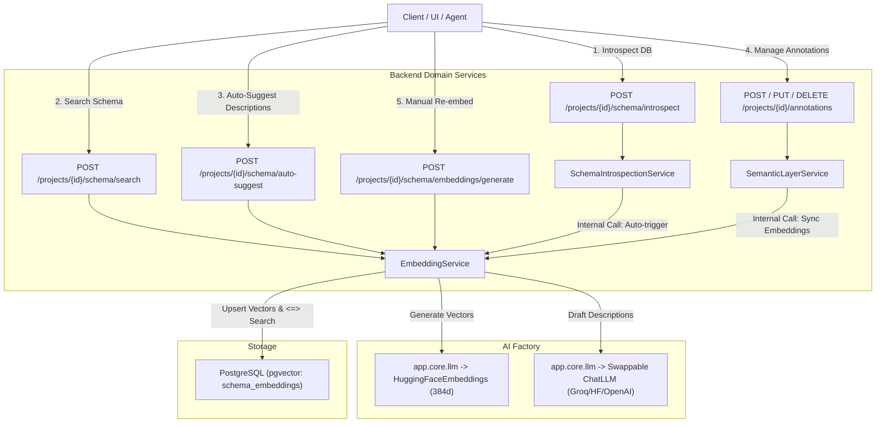
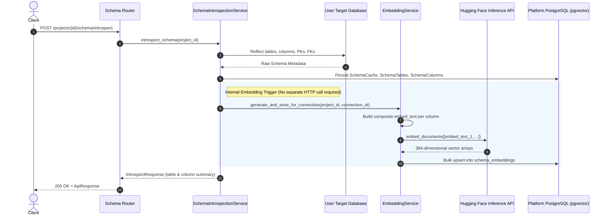
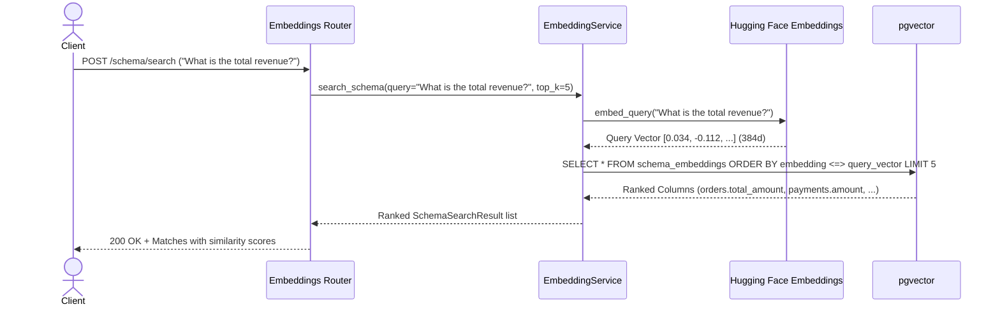

# Schema Embeddings & API Architecture Guide

This document explains how schema embeddings, vector search, auto-suggestions, and database introspection interact in the platform.

---

## 1. High-Level Architecture & API Map



---

## 2. API Endpoints Overview

| Method | Endpoint | Purpose | Internal Action |
| :--- | :--- | :--- | :--- |
| `POST` | `/api/v1/projects/{id}/schema/introspect` | Scans target database tables & columns | Saves schema **AND automatically generates embeddings** for all columns |
| `POST` | `/api/v1/projects/{id}/schema/search` | Natural language schema linking | Embeds user query → performs pgvector `<=>` cosine similarity search |
| `POST` | `/api/v1/projects/{id}/schema/auto-suggest` | Uses LLM to draft descriptions for a specific table (`table_id`) & its columns | Prompts LLM for descriptions → saves `SchemaAnnotation` → re-embeds |
| `POST` | `/api/v1/projects/{id}/schema/embeddings/generate` | Manual vector regeneration | Reconstructs composite text for all columns and stores 384d vectors |
| `POST/PUT/DELETE` | `/api/v1/projects/{id}/annotations` | User edits table/column notes | Updates annotation record → immediately syncs vector for that column |

---

## 3. What Happens During Introspection?

When you call `POST /api/v1/projects/{project_id}/schema/introspect`:



### Key Detail:
* **No secondary HTTP call is needed.** 
* When `POST /projects/{id}/schema/introspect` runs, `SchemaIntrospectionService` directly invokes `EmbeddingService.generate_and_store_for_connection()` in the backend so embeddings are immediately generated and searchable.

---

## 4. Structure of Composite `embed_text`

Every column embedding bakes in its parent table context + business descriptions into one searchable string:

```text
Table: public.orders
Columns: id, customer_id, total_amount, status, created_at
Primary Keys: id
Foreign Keys: customer_id -> customers.id
---
Column: total_amount
Type: NUMERIC(10,2)
Nullable: no
Primary Key: no
Foreign Key: no
---
Table Description: Customer sales orders and checkout transactions
Column Description: Total final monetary amount billed to the customer
```

---

## 5. Schema Search Flow (`POST /schema/search`)


