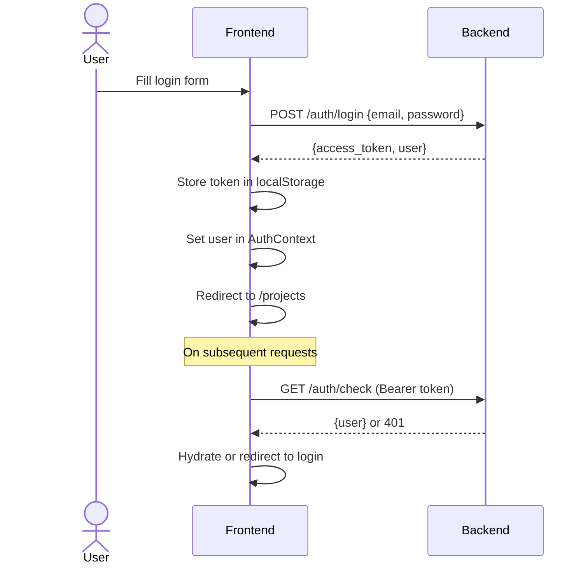
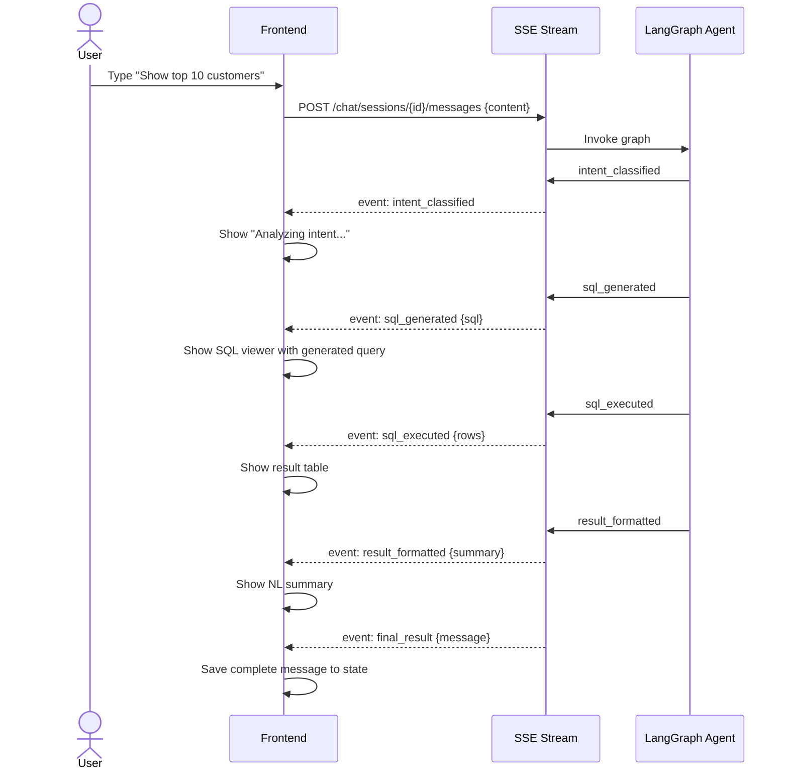

# Backend API Integration Guide — Frontend ↔ Backend Contract

> **Base URL**: `http://localhost:8000/api/v1`
> **Auth**: Bearer JWT token in `Authorization` header
> **Response Envelope**: All endpoints return `ApiResponse<T>` (see §1)
> **Content-Type**: `application/json` (except SSE streams: `text/event-stream`)

---

## 1. Standard Response Envelope

Every API response conforms to this shape. The frontend Axios interceptor should unwrap this automatically.

```typescript
// @/types/api.ts

interface ApiResponse<T> {
  success: boolean;
  message: string;
  data: T | null;
  error: ErrorDetail | null;
}

interface ErrorDetail {
  code: string;          // "NOT_FOUND", "BAD_REQUEST", "UNAUTHORIZED", etc.
  message: string;
  details: unknown | null;
}

interface PaginatedData<T> {
  items: T[];
  total: number;
  skip: number;
  limit: number;
}
```

### Pagination Query Parameters

All paginated endpoints accept:
- `skip` (int, default 0) — offset
- `limit` (int, default 20) — page size

---

## 2. Authentication — `/api/v1/auth`

### Types

```typescript
// @/types/auth.ts

interface User {
  id: string;           // UUID
  email: string;
  is_active: boolean;
  created_at: string;   // ISO 8601
  updated_at: string;
}

interface TokenResponse {
  access_token: string;
  token_type: "bearer";
  user: User;
}

interface UserCreate {
  email: string;
  password: string;
}

interface UserLogin {
  email: string;
  password: string;
}
```

### Endpoints

| Method | Path | Request Body | Response Type | Description |
| :--- | :--- | :--- | :--- | :--- |
| `POST` | `/auth/register` | `UserCreate` | `ApiResponse<User>` | Register new account. Returns 201. |
| `POST` | `/auth/login` | `UserLogin` | `ApiResponse<TokenResponse>` | Login. Returns JWT access token. |
| `POST` | `/auth/logout` | — | `ApiResponse<null>` | Logout current user. Requires auth. |
| `GET` | `/auth/me` | — | `ApiResponse<User>` | Get current user profile. Requires auth. |
| `GET` | `/auth/check` | — | `ApiResponse<User>` | Validate token & return user. Requires auth. |

### Frontend Integration

```typescript
// @/lib/api/auth.ts
export const authApi = {
  register: (data: UserCreate) =>
    apiClient.post<never, ApiResponse<User>>("/auth/register", data),

  login: (data: UserLogin) =>
    apiClient.post<never, ApiResponse<TokenResponse>>("/auth/login", data),

  logout: () =>
    apiClient.post<never, ApiResponse<null>>("/auth/logout"),

  me: () =>
    apiClient.get<never, ApiResponse<User>>("/auth/me"),

  check: () =>
    apiClient.get<never, ApiResponse<User>>("/auth/check"),
};
```

### Auth Flow



---

## 3. Projects — `/api/v1/projects`

### Types

```typescript
// @/types/project.ts

interface Project {
  id: string;
  owner_id: string;
  name: string;
  description: string | null;
  created_at: string;
  updated_at: string;
}

interface ProjectCreate {
  name: string;
  description?: string;
}

interface ProjectUpdate {
  name?: string;
  description?: string;
}
```

### Endpoints

| Method | Path | Body | Response | Description |
| :--- | :--- | :--- | :--- | :--- |
| `POST` | `/projects` | `ProjectCreate` | `ApiResponse<Project>` | Create project. 201. |
| `GET` | `/projects` | — | `ApiResponse<PaginatedData<Project>>` | List user's projects. Paginated. |
| `GET` | `/projects/{projectId}` | — | `ApiResponse<Project>` | Get single project. |
| `PATCH` | `/projects/{projectId}` | `ProjectUpdate` | `ApiResponse<Project>` | Update project. |
| `DELETE` | `/projects/{projectId}` | — | `ApiResponse<null>` | Delete project (cascades all resources). |

### Frontend Integration

```typescript
// @/lib/api/projects.ts
export const projectsApi = {
  create: (data: ProjectCreate) =>
    apiClient.post<never, ApiResponse<Project>>("/projects", data),

  list: (params?: { skip?: number; limit?: number }) =>
    apiClient.get<never, ApiResponse<PaginatedData<Project>>>("/projects", { params }),

  get: (projectId: string) =>
    apiClient.get<never, ApiResponse<Project>>(`/projects/${projectId}`),

  update: (projectId: string, data: ProjectUpdate) =>
    apiClient.patch<never, ApiResponse<Project>>(`/projects/${projectId}`, data),

  delete: (projectId: string) =>
    apiClient.delete<never, ApiResponse<null>>(`/projects/${projectId}`),
};
```

---

## 4. Database Connections — `/api/v1/projects/{projectId}/connections`

> Each project has **exactly one** connection (1:1 relationship).

### Types

```typescript
// @/types/connection.ts

interface Connection {
  id: string;
  project_id: string;
  name: string;
  dialect: "postgresql" | "mysql" | "mssql" | "snowflake" | "sqlite";
  created_at: string;
  updated_at: string;
  // NOTE: connection_string is NEVER returned by the API
}

interface ConnectionCreate {
  name: string;
  dialect: string;
  connection_string: string;   // Encrypted server-side before storage
}

interface ConnectionUpdate {
  name?: string;
  dialect?: string;
  connection_string?: string;
}

interface ConnectionTestRequest {
  connection_string?: string;  // Optional — tests saved connection if omitted
  dialect?: string;
}

interface ConnectionTestResponse {
  success: boolean;
  message: string;
  dialect: string;
  latency_ms: number | null;
}
```

### Endpoints

| Method | Path | Body | Response | Description |
| :--- | :--- | :--- | :--- | :--- |
| `POST` | `/projects/{projectId}/connections` | `ConnectionCreate` | `ApiResponse<Connection>` | Create & test connection. 201. |
| `GET` | `/projects/{projectId}/connections` | — | `ApiResponse<Connection>` | Get connection metadata (no credentials). |
| `PATCH` | `/projects/{projectId}/connections` | `ConnectionUpdate` | `ApiResponse<Connection>` | Update connection. |
| `DELETE` | `/projects/{projectId}/connections` | — | `ApiResponse<null>` | Delete connection & dispose pools. |
| `POST` | `/projects/{projectId}/connections/test` | `ConnectionTestRequest?` | `ApiResponse<ConnectionTestResponse>` | Test connectivity. |

### Frontend Integration

```typescript
// @/lib/api/connections.ts
export const connectionsApi = {
  create: (projectId: string, data: ConnectionCreate) =>
    apiClient.post<never, ApiResponse<Connection>>(`/projects/${projectId}/connections`, data),

  get: (projectId: string) =>
    apiClient.get<never, ApiResponse<Connection>>(`/projects/${projectId}/connections`),

  update: (projectId: string, data: ConnectionUpdate) =>
    apiClient.patch<never, ApiResponse<Connection>>(`/projects/${projectId}/connections`, data),

  delete: (projectId: string) =>
    apiClient.delete<never, ApiResponse<null>>(`/projects/${projectId}/connections`),

  test: (projectId: string, data?: ConnectionTestRequest) =>
    apiClient.post<never, ApiResponse<ConnectionTestResponse>>(
      `/projects/${projectId}/connections/test`, data ?? {}
    ),
};
```

---

## 5. Schema Introspection — `/api/v1/projects/{projectId}/schema`

### Types

```typescript
// @/types/schema.ts

interface IntrospectResponse {
  connection_id: string;
  project_id: string;
  tables_count: number;
  columns_count: number;
  introspected_at: string;
}

interface SchemaOverviewResponse {
  project_id: string;
  connection_id: string;
  tables_count: number;
  columns_count: number;
  introspected_at: string;
  tables: TableSummary[];
}

interface TableSummary {
  id: string;
  table_name: string;
  schema_name: string | null;
  columns_count: number;
}

interface TableDetailResponse {
  id: string;
  table_name: string;
  schema_name: string | null;
  columns: ColumnDetail[];
}

interface ColumnDetail {
  id: string;
  column_name: string;
  data_type: string;
  is_nullable: boolean;
  is_primary_key: boolean;
  is_foreign_key: boolean;
  fk_target_table: string | null;
  fk_target_column: string | null;
  ordinal_position: number;
}
```

### Endpoints

| Method | Path | Body | Response | Description |
| :--- | :--- | :--- | :--- | :--- |
| `POST` | `/projects/{projectId}/schema/introspect` | — | `ApiResponse<IntrospectResponse>` | Trigger DB introspection. Auto-generates embeddings. |
| `GET` | `/projects/{projectId}/schema` | — | `ApiResponse<SchemaOverviewResponse>` | Get schema overview with table list. |
| `GET` | `/projects/{projectId}/schema/tables` | — | `ApiResponse<TableDetailResponse[]>` | List all tables with column details. |
| `GET` | `/projects/{projectId}/schema/tables/{tableName}` | — | `ApiResponse<TableDetailResponse>` | Get specific table metadata. |

### Frontend Integration

```typescript
// @/lib/api/schema.ts
export const schemaApi = {
  introspect: (projectId: string) =>
    apiClient.post<never, ApiResponse<IntrospectResponse>>(
      `/projects/${projectId}/schema/introspect`
    ),

  getOverview: (projectId: string) =>
    apiClient.get<never, ApiResponse<SchemaOverviewResponse>>(
      `/projects/${projectId}/schema`
    ),

  listTables: (projectId: string) =>
    apiClient.get<never, ApiResponse<TableDetailResponse[]>>(
      `/projects/${projectId}/schema/tables`
    ),

  getTable: (projectId: string, tableName: string) =>
    apiClient.get<never, ApiResponse<TableDetailResponse>>(
      `/projects/${projectId}/schema/tables/${tableName}`
    ),
};
```

---

## 6. Semantic Layer (Annotations) — `/api/v1/projects/{projectId}/annotations`

### Types

```typescript
// @/types/annotation.ts

interface Annotation {
  id: string;
  project_id: string;
  connection_id: string;
  schema_table_id: string | null;
  schema_column_id: string | null;
  target_type: "table" | "column";
  note: string;
  is_auto_generated: boolean;
  created_at: string;
  updated_at: string;
}

interface AnnotationCreate {
  target_type: "table" | "column";
  schema_table_id?: string;     // Required when target_type = "table"
  schema_column_id?: string;    // Required when target_type = "column"
  note: string;
}

interface AnnotationUpdate {
  note: string;
}
```

### Endpoints

| Method | Path | Body / Query | Response | Description |
| :--- | :--- | :--- | :--- | :--- |
| `POST` | `/projects/{projectId}/annotations` | `AnnotationCreate` | `ApiResponse<Annotation>` | Create annotation. 201. |
| `GET` | `/projects/{projectId}/annotations` | `?target_type=table\|column` | `ApiResponse<Annotation[]>` | List annotations. |
| `GET` | `/projects/{projectId}/annotations/{annotationId}` | — | `ApiResponse<Annotation>` | Get single annotation. |
| `PUT` | `/projects/{projectId}/annotations/{annotationId}` | `AnnotationUpdate` | `ApiResponse<Annotation>` | Update annotation note. |
| `DELETE` | `/projects/{projectId}/annotations/{annotationId}` | — | `ApiResponse<null>` | Delete annotation. |

### Frontend Integration

```typescript
// @/lib/api/annotations.ts
export const annotationsApi = {
  create: (projectId: string, data: AnnotationCreate) =>
    apiClient.post<never, ApiResponse<Annotation>>(
      `/projects/${projectId}/annotations`, data
    ),

  list: (projectId: string, targetType?: "table" | "column") =>
    apiClient.get<never, ApiResponse<Annotation[]>>(
      `/projects/${projectId}/annotations`,
      { params: targetType ? { target_type: targetType } : undefined }
    ),

  get: (projectId: string, annotationId: string) =>
    apiClient.get<never, ApiResponse<Annotation>>(
      `/projects/${projectId}/annotations/${annotationId}`
    ),

  update: (projectId: string, annotationId: string, data: AnnotationUpdate) =>
    apiClient.put<never, ApiResponse<Annotation>>(
      `/projects/${projectId}/annotations/${annotationId}`, data
    ),

  delete: (projectId: string, annotationId: string) =>
    apiClient.delete<never, ApiResponse<null>>(
      `/projects/${projectId}/annotations/${annotationId}`
    ),
};
```

---

## 7. Embeddings & Vector Search — `/api/v1/projects/{projectId}/schema`

### Types

```typescript
// @/types/embedding.ts

interface SchemaSearchRequest {
  query: string;
  top_k?: number;      // default 10
}

interface SchemaSearchResult {
  column_id: string;
  table_name: string;
  schema_name: string | null;
  column_name: string;
  data_type: string;
  is_primary_key: boolean;
  is_foreign_key: boolean;
  fk_target_table: string | null;
  fk_target_column: string | null;
  embed_text: string;
  similarity_score: number;
}

interface EmbeddingGenerateResponse {
  project_id: string;
  connection_id: string;
  embedded_columns_count: number;
  model: string;
  dimensions: number;
}

interface AutoSuggestResponse {
  suggested_tables_count: number;
  suggested_columns_count: number;
  total_annotations_created: number;
}

// SSE Event types for embedding generation stream
interface EmbeddingSSEEvent {
  event: "progress" | "table_start" | "column_embedded" | "batch_complete" | "complete" | "error";
  table_name?: string;
  column_name?: string;
  columns_processed?: number;
  total_columns?: number;
  progress_percent?: number;
  message?: string;
  error?: string;
}
```

### Endpoints

| Method | Path | Body / Query | Response | Description |
| :--- | :--- | :--- | :--- | :--- |
| `POST` | `/projects/{projectId}/schema/search` | `SchemaSearchRequest` | `ApiResponse<SchemaSearchResult[]>` | Vector similarity search. |
| `POST` | `/projects/{projectId}/schema/embeddings/generate` | `?stream=true` | `ApiResponse<EmbeddingGenerateResponse>` or SSE stream | Generate embeddings. With `stream=true` returns SSE. |
| `GET` | `/projects/{projectId}/schema/embeddings/generate/events` | — | SSE stream | SSE stream for EventSource-compatible clients. |
| `POST` | `/projects/{projectId}/schema/auto-suggest` | — | `ApiResponse<AutoSuggestResponse>` | Auto-suggest descriptions via LLM. |

### Frontend Integration

```typescript
// @/lib/api/embeddings.ts
export const embeddingsApi = {
  search: (projectId: string, data: SchemaSearchRequest) =>
    apiClient.post<never, ApiResponse<SchemaSearchResult[]>>(
      `/projects/${projectId}/schema/search`, data
    ),

  generate: (projectId: string) =>
    apiClient.post<never, ApiResponse<EmbeddingGenerateResponse>>(
      `/projects/${projectId}/schema/embeddings/generate`
    ),

  autoSuggest: (projectId: string) =>
    apiClient.post<never, ApiResponse<AutoSuggestResponse>>(
      `/projects/${projectId}/schema/auto-suggest`
    ),
};

// SSE streaming for embedding generation — uses raw fetch, NOT axios
export function streamEmbeddingGeneration(
  projectId: string,
  token: string,
  onEvent: (event: EmbeddingSSEEvent) => void,
  onError: (error: Error) => void,
  onComplete: () => void,
): AbortController {
  const controller = new AbortController();
  const url = `${API_BASE_URL}/projects/${projectId}/schema/embeddings/generate?stream=true`;

  fetch(url, {
    method: "POST",
    headers: {
      Authorization: `Bearer ${token}`,
      "Content-Type": "application/json",
    },
    signal: controller.signal,
  })
    .then((response) => {
      const reader = response.body!.getReader();
      const decoder = new TextDecoder();
      // Parse SSE events from stream...
    })
    .catch(onError);

  return controller;
}
```

---

## 8. Chat & Agent — `/api/v1/projects/{projectId}/chat`

### Types

```typescript
// @/types/chat.ts

interface ChatSession {
  id: string;
  project_id: string;
  connection_id: string;
  title: string | null;
  created_at: string;
  updated_at: string;
}

interface ChatSessionCreate {
  title?: string;
}

interface ChatSessionUpdate {
  title: string;
}

interface ChatMessage {
  id: string;
  session_id: string;
  project_id: string;
  role: "user" | "assistant" | "system";
  content: string;
  token_count: number | null;
  metadata: Record<string, unknown> | null;
  query_run_id: string | null;
  created_at: string;
}

interface ChatMessageRequest {
  content: string;
}

// SSE Event types for chat message streaming
interface ChatSSEEvent {
  event: "intent_classified" | "sql_generated" | "sql_executed" | "sql_error" | "result_formatted" | "final_result" | "error";
  intent_type?: string;
  generated_sql?: string;
  execution_result?: Record<string, unknown>[];
  result_row_count?: number;
  nl_summary?: string;
  error_message?: string;
  retry_count?: number;
  message?: ChatMessage;
}
```

### Endpoints

| Method | Path | Body | Response | Description |
| :--- | :--- | :--- | :--- | :--- |
| `POST` | `/projects/{projectId}/chat/sessions` | `ChatSessionCreate` | `ApiResponse<ChatSession>` | Create chat session. 201. |
| `GET` | `/projects/{projectId}/chat/sessions` | — | `ApiResponse<PaginatedData<ChatSession>>` | List sessions. Paginated. |
| `GET` | `/projects/{projectId}/chat/sessions/{sessionId}` | — | `ApiResponse<ChatSession>` | Get session. |
| `PATCH` | `/projects/{projectId}/chat/sessions/{sessionId}` | `ChatSessionUpdate` | `ApiResponse<ChatSession>` | Update session title. |
| `DELETE` | `/projects/{projectId}/chat/sessions/{sessionId}` | — | `ApiResponse<null>` | Delete session + all messages. |
| `GET` | `/projects/{projectId}/chat/sessions/{sessionId}/messages` | — | `ApiResponse<PaginatedData<ChatMessage>>` | List messages. Paginated. |
| `POST` | `/projects/{projectId}/chat/sessions/{sessionId}/messages` | `ChatMessageRequest` | **SSE Stream** | Send query → stream agent events. |

### Frontend Integration

```typescript
// @/lib/api/chat.ts
export const chatApi = {
  createSession: (projectId: string, data?: ChatSessionCreate) =>
    apiClient.post<never, ApiResponse<ChatSession>>(
      `/projects/${projectId}/chat/sessions`, data ?? {}
    ),

  listSessions: (projectId: string, params?: { skip?: number; limit?: number }) =>
    apiClient.get<never, ApiResponse<PaginatedData<ChatSession>>>(
      `/projects/${projectId}/chat/sessions`, { params }
    ),

  getSession: (projectId: string, sessionId: string) =>
    apiClient.get<never, ApiResponse<ChatSession>>(
      `/projects/${projectId}/chat/sessions/${sessionId}`
    ),

  updateSession: (projectId: string, sessionId: string, data: ChatSessionUpdate) =>
    apiClient.patch<never, ApiResponse<ChatSession>>(
      `/projects/${projectId}/chat/sessions/${sessionId}`, data
    ),

  deleteSession: (projectId: string, sessionId: string) =>
    apiClient.delete<never, ApiResponse<null>>(
      `/projects/${projectId}/chat/sessions/${sessionId}`
    ),

  listMessages: (projectId: string, sessionId: string, params?: { skip?: number; limit?: number }) =>
    apiClient.get<never, ApiResponse<PaginatedData<ChatMessage>>>(
      `/projects/${projectId}/chat/sessions/${sessionId}/messages`, { params }
    ),
};

// SSE streaming for chat — uses raw fetch, NOT axios
export function streamChatMessage(
  projectId: string,
  sessionId: string,
  content: string,
  token: string,
  onEvent: (event: ChatSSEEvent) => void,
  onError: (error: Error) => void,
): AbortController {
  const controller = new AbortController();
  const url = `${API_BASE_URL}/projects/${projectId}/chat/sessions/${sessionId}/messages`;

  fetch(url, {
    method: "POST",
    headers: {
      Authorization: `Bearer ${token}`,
      "Content-Type": "application/json",
    },
    body: JSON.stringify({ content }),
    signal: controller.signal,
  })
    .then(async (response) => {
      const reader = response.body!.getReader();
      const decoder = new TextDecoder();
      let buffer = "";

      while (true) {
        const { done, value } = await reader.read();
        if (done) break;

        buffer += decoder.decode(value, { stream: true });
        const lines = buffer.split("\n");
        buffer = lines.pop() ?? "";

        for (const line of lines) {
          if (line.startsWith("data: ")) {
            try {
              const event: ChatSSEEvent = JSON.parse(line.slice(6));
              onEvent(event);
            } catch { /* skip malformed lines */ }
          }
        }
      }
    })
    .catch((error) => {
      if (error.name !== "AbortError") onError(error);
    });

  return controller;
}
```

### Chat SSE Event Flow



---

## 9. Health Check

| Method | Path | Response | Description |
| :--- | :--- | :--- | :--- |
| `GET` | `/health` | `ApiResponse<HealthStatus>` | Check server + DB health. |
| `GET` | `/api/v1/health` | `ApiResponse<HealthStatus>` | Same, versioned path. |

```typescript
interface HealthStatus {
  status: "healthy" | "degraded";
  database: "connected" | "disconnected";
  version: string;
}
```

---

## 10. Error Codes Reference

| HTTP Status | Error Code | When |
| :--- | :--- | :--- |
| 400 | `BAD_REQUEST` | Invalid input, validation failure |
| 401 | `UNAUTHORIZED` | Missing/invalid/expired JWT token |
| 403 | `FORBIDDEN` | User doesn't own the resource |
| 404 | `NOT_FOUND` | Resource doesn't exist |
| 409 | `CONFLICT` | Duplicate resource (e.g., email already registered, connection already exists) |
| 422 | `VALIDATION_ERROR` | Pydantic validation failure |
| 500 | `INTERNAL_ERROR` | Unhandled server error |
| 503 | `SERVICE_UNAVAILABLE` | Database unreachable |

### Frontend Error Handling Pattern

```typescript
// In Axios response interceptor
apiClient.interceptors.response.use(
  (response) => response.data, // Unwrap to ApiResponse<T>
  (error) => {
    const status = error.response?.status;
    const apiError = error.response?.data as ApiResponse<null> | undefined;

    if (status === 401) {
      // Clear auth state, redirect to /login
      clearAuth();
      window.location.href = "/login";
    }

    // Re-throw with structured error for component-level handling
    throw {
      code: apiError?.error?.code ?? "NETWORK_ERROR",
      message: apiError?.error?.message ?? apiError?.message ?? "Network error",
      status,
    };
  }
);
```

---

## 11. CORS Configuration

The backend allows:
- **Origins**: Configurable via `CORS_ORIGINS` env var (default includes `http://localhost:3000`)
- **Methods**: All (`*`)
- **Headers**: All (`*`)
- **Credentials**: `true`

No special CORS handling needed on the frontend as long as the backend includes `http://localhost:3000` in its allowed origins.
