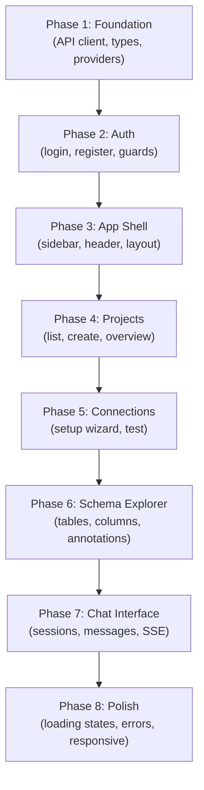

# Implementation Plan: Frontend — Component-Based Architecture

## Overview

Build the complete frontend for the Natural Language Database Querying Platform using **Next.js 16 (App Router) + React 19 + Tailwind CSS v4 + Shadcn UI**. The frontend will provide: authentication (login/register), project management, database connection setup, schema exploration with annotations, and a real-time NL-to-SQL chat interface with SSE streaming.

The frontend is already scaffolded with Next.js 16, Shadcn UI (`base-nova`), a `Button` component, and a Phase 2 embeddings demo page. This plan builds the production application on top of that foundation.

---

## User Review Required

> [!IMPORTANT]
> **Additional Dependencies Needed** — The plan requires installing: `react-hook-form`, `@hookform/resolvers`, `zod`, `sonner`, and several Shadcn UI components. These will be added incrementally during Phase 1.

> [!IMPORTANT]
> **Auth Strategy** — The plan uses JWT stored in `localStorage` with Axios interceptors. If you prefer `httpOnly` cookies or a different auth strategy, this needs to change before Phase 2.

> [!IMPORTANT]
> **Dark Theme Only or Light + Dark?** — The existing landing page uses a dark zinc-950 theme. Should the full app be dark-only, or should it support a light/dark toggle? The plan currently assumes **dark-only** to match the existing aesthetic.

---

## Open Questions

> [!IMPORTANT]
> **1. Landing Page** — Should the current landing page (`/`) remain as-is, or should it become a redirect to `/projects` (if authenticated) or `/login` (if not)? / should be home page and login page and register page should be different

> [!IMPORTANT]
> **2. Branding** — What should the app name, logo, and tagline be? Currently shows "NL-DB Query Platform". This affects the sidebar, header, and page titles. the platform name should be "AskMyDB"

> [!IMPORTANT]
> **3. Embeddings Demo Page** — Should `/embeddings-demo` be kept as a standalone page, integrated into the schema explorer, or removed?

---

## Architecture Decisions

- **Component-based architecture**: Domain components in `components/<domain>/`, reusable primitives in `components/ui/` (Shadcn) and `components/common/`. Pages are thin orchestrators.
- **API layer separation**: All API calls go through typed service modules in `lib/api/`. Components never call `fetch()` or `axios` directly (except SSE streams).
- **Auth via React Context**: `AuthProvider` + `useAuth()` hook. No external state management library.
- **Route groups**: `(auth)` for unauthenticated pages, `(dashboard)` for authenticated pages with the app shell.
- **Server Components by default**: Only `"use client"` where hooks/interactivity required.
- **Form handling**: React Hook Form + Zod for all forms.
- **SSE streaming**: Raw `fetch()` + `ReadableStream` for chat and embedding generation streams.

---

## Dependency Graph



---

## Proposed Changes

### Phase 1: Foundation — Types, API Client, Providers

Set up the foundational infrastructure that every feature depends on.

#### [NEW] `src/types/api.ts`
- `ApiResponse<T>`, `PaginatedData<T>`, `ErrorDetail` — matching backend envelope exactly.

#### [NEW] `src/types/auth.ts`
- `User`, `UserCreate`, `UserLogin`, `TokenResponse` interfaces.

#### [NEW] `src/types/project.ts`
- `Project`, `ProjectCreate`, `ProjectUpdate` interfaces.

#### [NEW] `src/types/connection.ts`
- `Connection`, `ConnectionCreate`, `ConnectionUpdate`, `ConnectionTestRequest`, `ConnectionTestResponse` interfaces.

#### [NEW] `src/types/schema.ts`
- `IntrospectResponse`, `SchemaOverviewResponse`, `TableSummary`, `TableDetailResponse`, `ColumnDetail` interfaces.

#### [NEW] `src/types/annotation.ts`
- `Annotation`, `AnnotationCreate`, `AnnotationUpdate` interfaces.

#### [NEW] `src/types/embedding.ts`
- `SchemaSearchRequest`, `SchemaSearchResult`, `EmbeddingGenerateResponse`, `AutoSuggestResponse`, `EmbeddingSSEEvent` interfaces.

#### [NEW] `src/types/chat.ts`
- `ChatSession`, `ChatSessionCreate`, `ChatSessionUpdate`, `ChatMessage`, `ChatMessageRequest`, `ChatSSEEvent` interfaces.

#### [NEW] `src/lib/api/client.ts`
- Axios instance with `baseURL` from `NEXT_PUBLIC_API_URL`.
- Request interceptor attaching JWT Bearer token.
- Response interceptor unwrapping `ApiResponse<T>` and handling 401.

#### [NEW] `src/lib/api/auth.ts`, `projects.ts`, `connections.ts`, `schema.ts`, `annotations.ts`, `embeddings.ts`, `chat.ts`
- Domain-specific API function objects following the pattern in the API integration guide.

#### [NEW] `src/lib/constants.ts`
- `API_BASE_URL`, `APP_NAME`, `TOKEN_KEY` constants.

#### [NEW] `src/lib/validations.ts`
- Shared Zod schemas for forms (email, password, project name, connection string).

#### [NEW] `src/providers/auth-provider.tsx`
- `AuthContext` + `AuthProvider` with `user`, `token`, `login()`, `logout()`, `register()`, `isLoading`, `isAuthenticated`.
- On mount: check `localStorage` for token → call `/auth/check` → hydrate user.

#### [NEW] `src/providers/providers.tsx`
- Compose `AuthProvider` + `Toaster` (Sonner) into a single `Providers` wrapper.

#### [MODIFY] `src/app/layout.tsx`
- Wrap `{children}` with `<Providers>`.
- Update metadata title and description.

**Dependencies:** None
**Estimated scope:** Large (15+ files, but all small)

---

### Phase 2: Authentication Pages

Build login and register pages with form validation and auth flow.

#### [NEW] `src/app/(auth)/layout.tsx`
- Centered layout for auth pages. No sidebar. Redirect to `/projects` if already authenticated.

#### [NEW] `src/app/(auth)/login/page.tsx`
- Page component rendering `LoginForm`.

#### [NEW] `src/app/(auth)/register/page.tsx`
- Page component rendering `RegisterForm`.

#### [NEW] `src/components/auth/login-form.tsx`
- `"use client"`. React Hook Form + Zod. Email + password fields. Submit → `authApi.login()` → store token → redirect.

#### [NEW] `src/components/auth/register-form.tsx`
- `"use client"`. React Hook Form + Zod. Email + password + confirm password. Submit → `authApi.register()` → redirect to login.

#### [NEW] `src/components/auth/auth-guard.tsx`
- `"use client"`. Wraps children. If not authenticated, redirects to `/login`. Shows skeleton while checking.

#### Shadcn components to install:
- `input`, `label`, `card`, `separator`

**Dependencies:** Phase 1
**Estimated scope:** Medium (6 files)

---

### Phase 3: Application Shell & Navigation

Build the dashboard layout with sidebar, header, and navigation.

#### [NEW] `src/app/(dashboard)/layout.tsx`
- Wraps content in `AuthGuard` + `SidebarProvider`. Renders sidebar + header + `<main>`.

#### [NEW] `src/components/common/app-sidebar.tsx`
- `"use client"`. Shadcn `Sidebar` component. Links: Projects, Settings. Shows current user. Logout button.

#### [NEW] `src/components/common/header.tsx`
- Breadcrumb navigation. User avatar/dropdown. Mobile sidebar trigger.

#### [NEW] `src/components/common/page-header.tsx`
- Reusable page title + description + action button slot.

#### [NEW] `src/components/common/loading-spinner.tsx`
- Simple loading indicator with Tailwind animation.

#### [NEW] `src/components/common/empty-state.tsx`
- Reusable empty state with icon, title, description, and optional action button.

#### [NEW] `src/components/common/confirm-dialog.tsx`
- Reusable confirmation dialog for destructive actions (delete project, etc.).

#### Shadcn components to install:
- `sidebar`, `breadcrumb`, `dropdown-menu`, `avatar`, `dialog`, `tooltip`, `sheet`, `skeleton`, `badge`

**Dependencies:** Phase 2
**Estimated scope:** Medium (7 files)

---

### Phase 4: Project Management

Build the project list, creation, and overview pages.

#### [NEW] `src/app/(dashboard)/projects/page.tsx`
- Fetches `projectsApi.list()`. Renders `ProjectList`. "New Project" button opens dialog.

#### [NEW] `src/app/(dashboard)/projects/[projectId]/page.tsx`
- Project overview/dashboard. Shows connection status, schema stats, recent chat sessions.

#### [NEW] `src/app/(dashboard)/projects/[projectId]/layout.tsx`
- Project-scoped layout. Fetches project data. Provides `ProjectContext`. Renders sub-navigation tabs (Overview, Connection, Schema, Chat).

#### [NEW] `src/components/projects/project-list.tsx`
- Grid of `ProjectCard` components.

#### [NEW] `src/components/projects/project-card.tsx`
- Card showing project name, description, created date. Click navigates to project.

#### [NEW] `src/components/projects/create-project-dialog.tsx`
- `"use client"`. Dialog with React Hook Form. Name + description. Submit → `projectsApi.create()`.

#### [NEW] `src/providers/project-provider.tsx`
- `ProjectContext` + `ProjectProvider`. Holds current project data for nested pages.

#### [NEW] `src/hooks/use-project.ts`
- Hook to access `ProjectContext`.

#### Shadcn components to install:
- `tabs`, `table`

**Dependencies:** Phase 3
**Estimated scope:** Medium (8 files)

---

### Phase 5: Database Connection Setup

Build the connection configuration page with test functionality.

#### [NEW] `src/app/(dashboard)/projects/[projectId]/connection/page.tsx`
- Shows existing connection or setup wizard. Connection test button.

#### [NEW] `src/components/connections/connection-form.tsx`
- `"use client"`. React Hook Form + Zod. Fields: name, dialect (select), connection string (textarea). Supports create + update modes.

#### [NEW] `src/components/connections/connection-status.tsx`
- Shows connected/disconnected status badge. Test connection button with result display.

#### [NEW] `src/components/connections/dialect-select.tsx`
- Select dropdown for supported dialects: PostgreSQL, MySQL, SQL Server, Snowflake, SQLite.

#### Shadcn components to install:
- `select`, `textarea`

**Dependencies:** Phase 4
**Estimated scope:** Small (4 files)

---

### Phase 6: Schema Explorer & Annotations

Build the schema browser with table/column viewer and annotation editor.

#### [NEW] `src/app/(dashboard)/projects/[projectId]/schema/page.tsx`
- Schema overview. Introspect button. Table list. Search bar for vector search.

#### [NEW] `src/components/schema/schema-overview.tsx`
- Stats cards: tables count, columns count, last introspected timestamp. Introspect/re-introspect button.

#### [NEW] `src/components/schema/table-list.tsx`
- Accordion/expandable list of tables. Each expands to show `ColumnTable`.

#### [NEW] `src/components/schema/column-table.tsx`
- Data table showing columns: name, type, nullable, PK, FK, annotations. Inline annotation editing.

#### [NEW] `src/components/schema/annotation-editor.tsx`
- `"use client"`. Inline text editor for adding/editing notes on tables and columns. Auto-saves on blur.

#### [NEW] `src/components/schema/schema-search.tsx`
- `"use client"`. Search input → calls `embeddingsApi.search()` → displays ranked column results with similarity scores.

#### Shadcn components to install:
- `accordion`, `collapsible`

**Dependencies:** Phase 5
**Estimated scope:** Medium (6 files)

---

### Phase 7: Chat Interface — The Core Feature

Build the NL-to-SQL chat with real-time SSE streaming.

#### [NEW] `src/app/(dashboard)/projects/[projectId]/chat/page.tsx`
- Lists existing sessions. "New Chat" button. Click session → navigate to it.

#### [NEW] `src/app/(dashboard)/projects/[projectId]/chat/[sessionId]/page.tsx`
- Full chat view. Message list + input. SSE streaming display.

#### [NEW] `src/components/chat/session-sidebar.tsx`
- `"use client"`. List of chat sessions for the project. Active session highlighted. Delete/rename actions.

#### [NEW] `src/components/chat/message-list.tsx`
- Scrollable message container. Renders `MessageBubble` for each message. Auto-scrolls on new messages.

#### [NEW] `src/components/chat/message-bubble.tsx`
- User messages (right-aligned) and assistant messages (left-aligned). Assistant messages show SQL viewer, result table, and NL summary.

#### [NEW] `src/components/chat/chat-input.tsx`
- `"use client"`. Textarea with send button. Enter to send, Shift+Enter for newline. Disabled while streaming.

#### [NEW] `src/components/chat/sql-viewer.tsx`
- Code block with syntax highlighting for generated SQL. Copy button.

#### [NEW] `src/components/chat/query-result-table.tsx`
- Data table rendering query execution results. Column headers from result keys. Scrollable. Row count badge.

#### [NEW] `src/components/chat/sse-status-indicator.tsx`
- Shows pipeline progress during SSE streaming: "Classifying intent..." → "Generating SQL..." → "Executing..." → "Formatting results...".

#### [NEW] `src/hooks/use-sse.ts`
- Generic SSE hook for streaming fetch with typed events, abort, and error handling.

**Dependencies:** Phase 6
**Estimated scope:** Large (10 files)

---

### Phase 8: Polish — Error States, Loading, Responsive

#### [NEW] `src/components/common/error-boundary.tsx`
- React Error Boundary with fallback UI.

#### [MODIFY] All page components
- Add proper loading skeletons using Shadcn `Skeleton`.
- Add empty states using `EmptyState` component.
- Add error handling with toast notifications.

#### [MODIFY] `src/app/globals.css`
- Refine theme tokens. Ensure consistent dark theme throughout.

#### [MODIFY] `src/app/page.tsx`
- Convert to redirect: authenticated → `/projects`, unauthenticated → `/login`.

#### Install Sonner for toast notifications:
- `npx shadcn@latest add sonner`

**Dependencies:** Phase 7
**Estimated scope:** Medium (scattered changes)

---

## Verification Plan

### Automated Tests
```bash
# Build check — must compile without errors
npm run build

# Lint check
npm run lint
```

### Manual Verification
- [ ] Register a new account → verify redirect to login
- [ ] Login → verify redirect to projects dashboard
- [ ] Create a project → verify it appears in the list
- [ ] Add a database connection → test connectivity
- [ ] Trigger schema introspection → verify table/column browser
- [ ] Add annotations to tables/columns → verify save
- [ ] Run vector search → verify ranked results
- [ ] Create a chat session → send NL query → verify SSE streaming shows pipeline steps
- [ ] Verify follow-up queries in same session work (multi-turn)
- [ ] Verify 401 handling: clear token → verify redirect to login
- [ ] Verify responsive layout on tablet (768px)

---

## Risks and Mitigations

| Risk | Impact | Mitigation |
|------|--------|------------|
| Next.js 16 breaking changes from training data | High | Always consult `node_modules/next/dist/docs/` before writing code. |
| SSE streaming parsing edge cases | Medium | Robust buffer/line-split parser. Test with slow connections. |
| Backend CORS misconfiguration | Low | Verify `http://localhost:3000` is in `CORS_ORIGINS`. |
| Large schema (50+ tables) performance | Medium | Virtualize table list. Paginate where possible. |
| JWT token expiry UX | Low | Interceptor auto-redirects to login on 401. |

---

## File Count Summary

| Phase | New Files | Modified | Total |
|-------|-----------|----------|-------|
| 1 — Foundation | ~18 | 1 | ~19 |
| 2 — Auth | 6 | 0 | 6 |
| 3 — App Shell | 7 | 0 | 7 |
| 4 — Projects | 8 | 0 | 8 |
| 5 — Connections | 4 | 0 | 4 |
| 6 — Schema | 6 | 0 | 6 |
| 7 — Chat | 10 | 0 | 10 |
| 8 — Polish | 1 | ~5 | ~6 |
| **Total** | **~60** | **~6** | **~66** |
