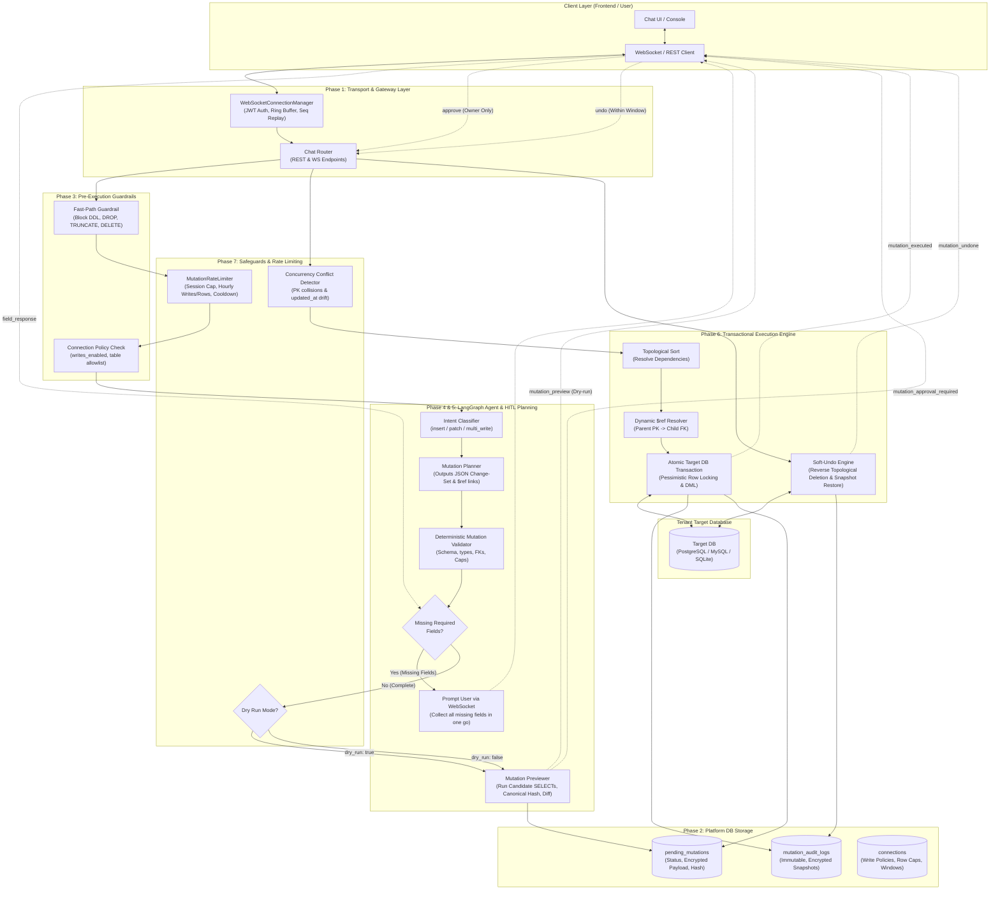
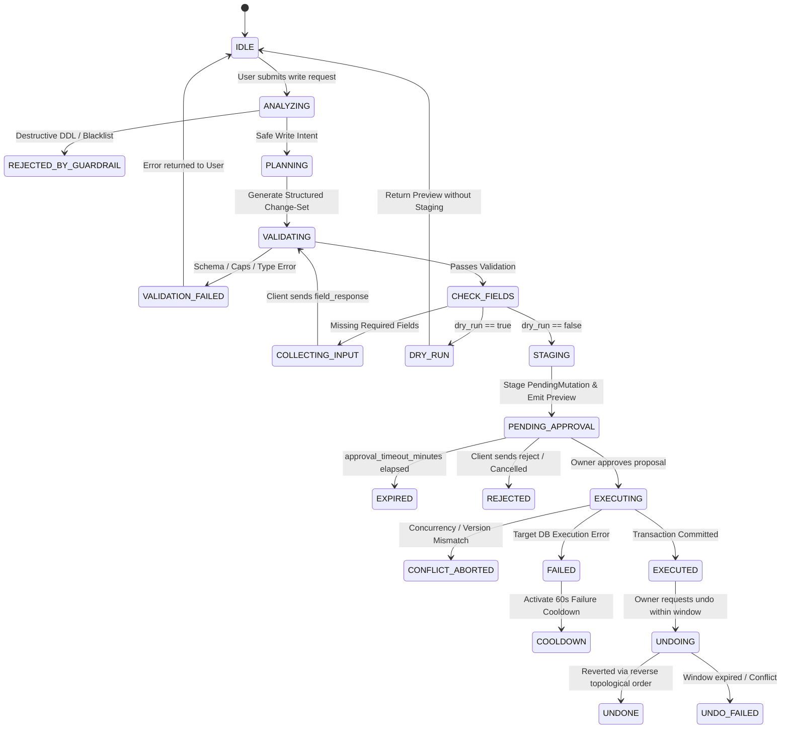

# Safe Database Write Pipeline (Phases 1–7): Architecture, Workflows & Safeguards

This document provides a comprehensive technical reference for the **Human-In-The-Loop (HITL) Safe Database Write Pipeline** implemented across **Phases 1 through 7**. It covers the complete architecture, data models, state machines, LangGraph orchestration, WebSocket protocol, transactional execution engine, and multi-layered defense safeguards.

---

## 1. High-Level Architectural Overview

The Safe Database Write Pipeline empowers the AI chatbot to plan and execute structured database modifications (`INSERT` and `PATCH`) while strictly upholding zero-trust database security.

### Core Architectural Principles
1. **Zero Raw DML Generation by LLM**: The LLM is strictly prohibited from writing raw SQL for write operations (`INSERT`, `UPDATE`, `DELETE`). The LLM only generates structured JSON change-sets that define tables, columns, operations, and dynamic `$ref` bindings.
2. **Deterministic Dual-Layer Validation**: Every change-set is validated by deterministic code against the target database's live reflected schema and connection-level safety policies before any human is asked to review it.
3. **Mandatory Human-in-the-Loop (HITL) Approval**: No write query ever touches the target database without explicit, cryptographically verified approval from the **Project Owner**.
4. **Isolated Multi-Tenant Security**: Every query, staged mutation, lock, and audit log is strictly scoped by `project_id` and verified against user credentials.
5. **Atomic Transactional Execution with Row Locking**: All multi-table operations execute within a single atomic database transaction (`BEGIN ... COMMIT / ROLLBACK`). Updates enforce pessimistic row-level locking (`FOR UPDATE`) and verify that locked row counts exactly match the approved preview.
6. **Encrypted Append-Only Auditing & Soft-Undo**: Every execution records Fernet-encrypted before/after row snapshots in an immutable audit ledger, enabling point-in-time reversibility within a configurable undo window.

---

## 2. End-to-End System Architecture Diagram



---

## 3. Detailed Breakdown of Implemented Phases

### Phase 1: WebSocket Transport Infrastructure & Streaming Baseline
- **Primary Goal**: Establish a fault-tolerant, bidirectional WebSocket transport layer capable of sub-millisecond event streaming, heartbeat verification, interactive prompt-and-response frames, and automatic reconnection with zero state loss.
- **Key Modules**:
  - `backend/app/core/websocket.py`: Core `WebSocketConnectionManager`.
  - `backend/app/domain/chat/router.py`: Route endpoint `GET /projects/{project_id}/chat/sessions/{session_id}/ws`.
  - `backend/app/domain/chat/services.py`: Refactored streaming generator decoupled from HTTP SSE.
- **Key Capabilities**:
  1. **Authentication & Handshake**: Client provides JWT via query parameter (`?token=...`). Handshake authenticates the user, checks project membership, and rejects unauthorized connections with WebSocket close code `4001`.
  2. **Monotonic Sequence Numbering & Ring Buffer**: Every outbound event carries an incrementing `seq` number. An in-memory ring buffer retains the last 200 events per session. Clients reconnecting with `?last_seq=N` automatically receive missing frames.
  3. **Bi-directional Ping/Pong**: Ping/pong heartbeat frames prevent idle gateway timeouts.

---

### Phase 2: Database Models, Write Policies & Extended Schema Metadata
- **Primary Goal**: Establish persistent multi-tenant security policies, write quotas, and rich schema reflection metadata to empower deterministic validation.
- **Key Modules**:
  - `backend/app/domain/connections/models.py` & `schemas.py`: Write policy configuration.
  - `backend/app/domain/schema_introspection/models.py` & `services.py`: Extended reflection attributes.
  - `backend/app/domain/chat/models.py` & `repository.py`: `PendingMutation` and `MutationAuditLog` entities.
- **Data Model Schema**:

#### 1. Connection Write Policies (`connections` table)
| Column Name | Type | Description |
| :--- | :--- | :--- |
| `writes_enabled` | `Boolean` | Master toggle. Must be `true` for any write operation. Defaults to `false`. |
| `max_insert_rows_per_table` | `Integer` | Strict safety cap on inserted rows per table in a single request (default: 50). |
| `max_patch_rows_per_table` | `Integer` | Strict safety cap on updated rows per table (default: 20). |
| `max_total_rows_per_changeset`| `Integer` | Aggregate row modification limit across all tables (default: 100). |
| `max_tables_per_changeset` | `Integer` | Maximum distinct tables allowed in a single change-set (default: 5). |
| `approval_timeout_minutes` | `Integer` | Time-to-live for a staged proposal before automatic expiration (default: 15). |
| `undo_window_minutes` | `Integer` | Rolling window allowing soft-undo reversal (default: 10). Set to 0 to disable. |
| `allowed_tables` | `JSON / list[str]` | Optional explicit table allowlist. If set, only these tables can be written to. |
| `blocked_tables` | `JSON / list[str]` | Table denylist. System/audit tables are blocked unconditionally. |

#### 2. Staged Mutations (`pending_mutations` table)
| Column Name | Type | Description |
| :--- | :--- | :--- |
| `id` | `UUID (PK)` | Unique mutation identifier. |
| `project_id`, `session_id` | `UUID (FK)` | Multi-tenant isolation keys. |
| `connection_id` | `UUID (FK)` | Target database connection. |
| `proposer_id` | `UUID (FK)` | User who submitted the write request. |
| `approver_id` | `UUID (FK)` | Project owner who approved the execution (nullable until approved). |
| `change_set_encrypted` | `Text` | Fernet-encrypted JSON canonical change-set. |
| `change_set_hash` | `String(64)` | SHA-256 hash of the canonical JSON change-set. |
| `status` | `Enum` | `COLLECTING_INPUT`, `PENDING_APPROVAL`, `APPROVED`, `REJECTED`, `EXECUTED`, `FAILED`, `EXPIRED`, `UNDONE`. |
| `preview_row_counts` | `JSON` | Pre-calculated row count dictionary per table. |
| `expires_at` | `DateTime(UTC)` | Proposal expiration timestamp. |
| `executed_at` | `DateTime(UTC)` | Execution timestamp. |

#### 3. Append-Only Audit Ledger (`mutation_audit_logs` table)
| Column Name | Type | Description |
| :--- | :--- | :--- |
| `id` | `UUID (PK)` | Unique audit record identifier. |
| `mutation_id` | `UUID (FK)` | Associated pending mutation (nullable for direct logs). |
| `operation` | `String(32)` | `insert`, `patch`, `multi_write`, `undo`. |
| `change_set_hash` | `String(64)` | Immutable cryptographic fingerprint of executed change-set. |
| `status` | `String(32)` | `executed`, `failed`, `undone`. |
| `tables_affected` | `JSON` | List of affected tables with operation and row counts. |
| `total_rows_affected` | `Integer` | Total number of rows modified in the transaction. |
| `before_snapshot_encrypted` | `Text` | Fernet-encrypted pre-update row values (enables soft-undo). |
| `after_snapshot_encrypted` | `Text` | Fernet-encrypted post-update row values. |
| `latency_ms` | `Integer` | Target DB transaction latency in milliseconds. |

---

### Phase 3: Write Guardrails, Validation Engine & Cap Enforcement
- **Primary Goal**: Construct deterministic, zero-trust validation before staging any proposal or presenting it to the user.
- **Key Modules**:
  - `backend/app/domain/agent/guardrail.py`: Regex & semantic query screening.
  - `backend/app/domain/agent/nodes/mutation_validator.py`: Comprehensive schema and policy validator.
- **Deterministic Validation Rules**:
  1. **Destructive Statement Block**: Unconditionally blocks SQL keywords: `DROP`, `TRUNCATE`, `DELETE`, `ALTER`, `GRANT`, `REVOKE`, `ATTACH`, `DETACH`.
  2. **Table Existence & Access Validation**: Checks table presence in target database metadata. Verifies that the table exists in `allowed_tables` (if populated) and is not in `blocked_tables`.
  3. **Column Writeability Check**: Validates that all target columns exist and are not read-only (`is_generated`, `is_identity`, `is_autoincrement`, or autoincrement PKs).
  4. **Mandatory WHERE Filter on PATCH**: Every `PATCH` operation must include a non-empty `filter` specifying targeting criteria. Blanket table updates are strictly rejected.
  5. **Primary Key Requirement for PATCH**: Prevents updating tables lacking a defined primary key.
  6. **Multi-Tier Cap Enforcement**:
     - Insert rows per table $\le$ `connection.max_insert_rows_per_table`.
     - Patch rows per table $\le$ `connection.max_patch_rows_per_table`.
     - Total change-set rows $\le$ `connection.max_total_rows_per_changeset`.
     - Target table count $\le$ `connection.max_tables_per_changeset`.
  7. **Foreign Key Reference Validation**: Verifies referenced foreign key values against candidate parent tables, supporting both static literals and dynamic `$ref` expressions.

---

### Phase 4: Agent Write Path & LLM Mutation Planning (LangGraph)
- **Primary Goal**: Empower the agent to classify write intent and plan structured, multi-table change-sets with topological dependency ordering and foreign key propagation.
- **Key Modules**:
  - `backend/app/domain/agent/state.py`: Extended state definitions (`mutation_change_set`, `mutation_fields_pending`, etc.).
  - `backend/app/domain/agent/nodes/intent.py`: Intent routing (`insert`, `patch`, `multi_write`).
  - `backend/app/domain/agent/nodes/mutation_planner.py`: Structured change-set generation prompt and parser.
  - `backend/app/domain/agent/graph.py`: Conditional edge routing.
- **Change-Set JSON Specification**:
```json
{
  "summary": "Create new department and assign manager",
  "mutations": [
    {
      "sequence": 1,
      "operation": "insert",
      "table": "departments",
      "rows": [
        {
          "name": "Engineering",
          "code": "ENG"
        }
      ]
    },
    {
      "sequence": 2,
      "operation": "insert",
      "table": "employees",
      "rows": [
        {
          "name": "Alice Smith",
          "department_id": { "$ref": "mutations[0].rows[0].id" },
          "role": "Lead Architect"
        }
      ]
    }
  ]
}
```

---

### Phase 5: Interactive HITL Collection & WebSocket Approval Protocol
- **Primary Goal**: Facilitate seamless two-way interactive data collection for missing fields and enforce cryptographic, project-owner verification before execution.
- **Key Modules**:
  - `backend/app/domain/agent/nodes/missing_field_collector.py`: Missing field detector.
  - `backend/app/domain/agent/nodes/mutation_previewer.py`: Candidate row selector, hash generator, and preview builder.
  - `backend/app/domain/chat/services.py` & `router.py`: Approval and rejection handlers.
- **Workflow Highlights**:
  1. **Single-Turn Missing Field Collection**: The collector analyzes the schema for all non-nullable columns lacking default values or autoincrement attributes. It yields a structured `mutation_field_required` frame containing the complete list of missing fields with their data types.
  2. **Real-time Candidate Row Diff**: For `PATCH` mutations, the previewer issues read queries against the target database to extract current row values, rendering a side-by-side before/after preview.
  3. **Cryptographic Change-Set Hash**: Proposals are hashed using SHA-256 over canonical sorted JSON:
     $$\text{Hash} = \text{SHA256}(\text{sort\_keys}(\text{JSON}(\text{change\_set})))$$
     During approval, the incoming hash is verified against the stored hash to ensure tamper-proof execution.
  4. **Strict Authorization**: Only the authenticated **Project Owner** can approve or reject staged write mutations.

---

### Phase 6: Transactional Execution Engine & Auditing
- **Primary Goal**: Execute approved multi-table change-sets atomically with row locking, dynamic foreign key resolution, and encrypted append-only auditing.
- **Key Modules**:
  - `backend/app/domain/agent/nodes/mutation_executor.py`: Transaction runner and DAG resolver.
  - `backend/app/domain/chat/repository.py`: Audit log persistence.
- **Execution Lifecycle**:
```text
[Topological Sort (Kahn's DAG)]
              │
              ▼
[Begin Target DB Transaction (conn.begin())]
              │
              ▼
[Iterate Ordered Mutations]
  ├── For INSERT:
  │     ├── Parameterized execution
  │     └── Capture RETURNING / LAST_INSERT_ID into returning_registry
  │
  └── For PATCH:
        ├── SELECT ... FOR UPDATE (Row Locking)
        ├── Verify: locked_row_count == preview_row_count
        ├── Verify: updated_at/version timestamp drift
        ├── Record before_snapshot
        ├── Execute Parameterized UPDATE
        └── Record after_snapshot
              │
              ▼
[Commit Transaction (conn.commit())]
              │
              ▼
[Encrypt Snapshots (Fernet) & Write Append-Only Audit Log]
              │
              ▼
[Broadcast WebSocket Event: mutation_executed]
```

---

### Phase 7: Advanced Safeguards: Soft-Undo, Concurrency, Rate Limiting & Dry-Run
- **Primary Goal**: Layer production-grade safeguards onto the write pipeline to prevent race conditions, runaway mutations, and irreversible operational mistakes.
- **Key Modules**:
  - `backend/app/domain/chat/rate_limiter.py`: `MutationRateLimiter` engine.
  - `backend/app/domain/agent/nodes/mutation_executor.py`: Concurrency checks and `execute_undo_change_set`.
  - `backend/app/domain/chat/services.py`: `undo_mutation` service method.

#### 1. Dry-Run Mode
- Set `dry_run: true` in the chat message payload.
- Runs complete intent classification, mutation planning, deterministic validation, and candidate row queries.
- **Bypasses database staging**: No record is created in `pending_mutations`, ensuring zero queue pollution.
- Emits a `mutation_preview` WebSocket frame marked `dry_run: true` and formats a complete execution preview in chat.

#### 2. Rate Limiting & Cooldown Protection
Managed by the thread-safe `MutationRateLimiter`:
- **Session Pending Mutation Cap**: Maximum 3 concurrent active mutations (`PENDING_APPROVAL` or `COLLECTING_INPUT`) per session.
- **Hourly Project Transaction Cap**: Maximum 30 executed write transactions per project per rolling hour.
- **Hourly Project Row Cap**: Maximum 200 total rows written per project per rolling hour.
- **Post-Failure Cooldown**: Any failed write transaction triggers an immediate 60-second cooldown on that chat session to prevent automated cascading retries.

#### 3. Concurrency Conflict Detection
- **INSERT Protection**: Checks if an explicit primary key / ID already exists in the target table before inserting.
- **PATCH Protection**: During pessimistic row locking (`FOR UPDATE`), the executor inspects version tracking columns (`updated_at`, `last_modified`, `modified_at`, `version`). If the value in the live database differs from the preview candidate snapshot, the transaction immediately rolls back with `ConcurrencyConflictError`.

#### 4. Soft-Undo Engine
- Available if `connection.undo_window_minutes > 0` and requested within the rolling window.
- **Reverse Topological Order**: Operations are reverted in reverse dependency order (children deleted before parents).
- **INSERT Reversal**: Issues parameterized `DELETE FROM <table> WHERE <pk> = :id`.
- **PATCH Reversal**: Issues parameterized `UPDATE` restoring table rows to their exact pre-update values stored in the Fernet-encrypted `before_snapshot`.
- **Audit Logging**: Appends a new audit record with `operation="undo"`, marks the `PendingMutation` as `UNDONE`, and notifies connected clients via `mutation_undone`.

---

## 4. Complete Interactive State Machine



---

## 5. WebSocket Frame Protocol Reference

### Client-to-Server Inbound Frames
| Frame Type | Payload Structure | Purpose |
| :--- | :--- | :--- |
| `message` | `{"type": "message", "content": "Add user Bob", "dry_run": false}` | Send standard chat message or initiate write. |
| `field_response` | `{"type": "field_response", "session_id": "...", "fields": {"code": "ENG"}}` | Provide answers for missing schema fields. |
| `approve` | `{"type": "approve", "mutation_id": "...", "change_set_hash": "..."}` | Project owner approval for staged mutation. |
| `reject` | `{"type": "reject", "mutation_id": "...", "reason": "Incorrect value"}` | Explicit rejection of staged mutation. |
| `undo` | `{"type": "undo", "mutation_id": "...", "reason": "Accidental update"}` | Soft-undo request for executed mutation. |
| `ping` | `{"type": "ping"}` | Gateway keep-alive ping. |

### Server-to-Client Outbound Frames
| Frame Type | Payload Structure | Purpose |
| :--- | :--- | :--- |
| `mutation_field_required` | `{"fields": [{"name": "code", "type": "varchar(10)", "required": true}]}` | Informs client of missing fields to prompt user. |
| `mutation_preview` | `{"mutation_id": "...", "change_set": {...}, "candidate_rows": {...}}` | Renders candidate row diff and cap summaries. |
| `mutation_approval_required` | `{"mutation_id": "...", "change_set_hash": "...", "expires_at": "..."}` | Renders HITL Approval / Rejection action buttons. |
| `mutation_executed` | `{"mutation_id": "...", "total_rows_affected": 2, "tables": [...]}` | Confirms successful atomic database commit. |
| `mutation_failed` | `{"mutation_id": "...", "error": "Concurrency conflict on table..."}` | Informs client of rollback and error details. |
| `mutation_undone` | `{"mutation_id": "...", "total_rows_reverted": 2, "status": "UNDONE"}` | Confirms successful soft-undo reversal. |
| `pong` | `{"type": "pong"}` | Heartbeat pong response. |

---

## 6. Safeguards & Limits Reference Table

| Category | Policy / Limit Parameter | Default Value | Enforcement Node / Layer |
| :--- | :--- | :--- | :--- |
| **Row Caps** | `max_insert_rows_per_table` | 50 rows | `mutation_validator.py` |
| **Row Caps** | `max_patch_rows_per_table` | 20 rows | `mutation_validator.py` & `mutation_previewer.py` |
| **Change-Set Caps** | `max_total_rows_per_changeset` | 100 rows | `mutation_validator.py` |
| **Table Caps** | `max_tables_per_changeset` | 5 tables | `mutation_validator.py` |
| **Approval Window** | `approval_timeout_minutes` | 15 minutes | `ChatService.execute_mutation` |
| **Soft-Undo Window**| `undo_window_minutes` | 10 minutes | `ChatService.undo_mutation` |
| **Session Pending Limit** | `MAX_PENDING_MUTATIONS_PER_SESSION` | 3 mutations | `rate_limiter.py` |
| **Hourly Write Limit** | `MAX_WRITES_PER_PROJECT_PER_HOUR` | 30 writes/hour | `rate_limiter.py` |
| **Hourly Row Limit** | `MAX_ROWS_WRITTEN_PER_PROJECT_PER_HOUR` | 200 rows/hour | `rate_limiter.py` |
| **Failure Cooldown** | `FAILURE_COOLDOWN_SECONDS` | 60 seconds | `rate_limiter.py` |
| **Locking Timeout** | `lock_timeout` | 5.0 seconds | `mutation_executor.py` |
| **Hash Verification**| `change_set_hash` | SHA-256 | `ChatService.execute_mutation` |

---

## 7. Summary of Files Created & Modified

### New Modules Created Across Phases 1–7
- `backend/app/core/websocket.py`: WebSocket Connection Manager, JWT handling, and frame broadcasting.
- `backend/app/domain/chat/rate_limiter.py`: In-memory and SQL-backed multi-level rate limiter & cooldown engine.
- `backend/app/domain/agent/mutation_schemas.py`: Pydantic models for structured mutations and change-sets.
- `backend/app/domain/agent/nodes/mutation_planner.py`: LLM prompt orchestration for structured mutation plans.
- `backend/app/domain/agent/nodes/mutation_validator.py`: Comprehensive deterministic validation rules engine.
- `backend/app/domain/agent/nodes/missing_field_collector.py`: Missing field introspection and collection handler.
- `backend/app/domain/agent/nodes/mutation_previewer.py`: Candidate row queries, canonical hashing, and dry-run branching.
- `backend/app/domain/agent/nodes/mutation_executor.py`: Atomic transaction execution, row locking, dynamic `$ref` resolution, and soft-undo engine.
- `backend/app/domain/agent/nodes/mutation_result_formatter.py`: Result formatting and WebSocket notification dispatch.

### Existing Modules Extended
- `backend/app/domain/agent/guardrail.py`: Dual-mode guardrails (read vs write paths).
- `backend/app/domain/agent/nodes/intent.py`: Added write intent classification.
- `backend/app/domain/agent/graph.py`: LangGraph state machine with conditional routing and interrupt cycles.
- `backend/app/domain/agent/state.py`: Mutation state fields (`mutation_change_set`, `dry_run`, etc.).
- `backend/app/domain/connections/models.py`: Connection write policy fields and limits.
- `backend/app/domain/schema_introspection/models.py`: Reflection of generated/identity/autoincrement columns.
- `backend/app/domain/chat/models.py` & `repository.py`: `PendingMutation` and `MutationAuditLog` tables.
- `backend/app/domain/chat/services.py`: Complete HITL approval, rejection, streaming, rate limiting, and undo workflows.
- `backend/app/domain/chat/router.py`: WebSocket frame multiplexer and REST HITL fallback routes.
